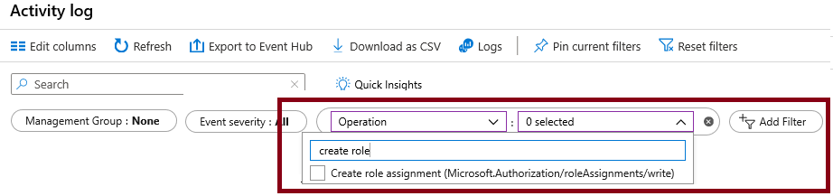

---
lab:
  title: 'Lab 02a: Mengelola Langganan dan RBAC'
  module: Administer Governance and Compliance
---

# Lab 02a - Mengelola Langganan dan RBAC

## Pengenalan lab

Di lab ini, Anda mempelajari tentang kontrol akses berbasis peran. Anda mempelajari cara menggunakan izin dan cakupan untuk mengontrol tindakan apa yang dapat dan tidak dapat dilakukan oleh identitas. Anda juga mempelajari cara mempermudah manajemen langganan menggunakan grup manajemen. 

Lab ini memerlukan langganan Azure. Tipe langganan Anda dapat memengaruhi ketersediaan fitur di lab ini. Anda dapat mengubah wilayah, tetapi langkah-langkahnya ditulis menggunakan **US Timur**. 

## Perkiraan waktu: 30 menit

## Skenario lab

Untuk menyederhanakan manajemen sumber daya Azure di organisasi Anda, Anda telah ditugaskan untuk menerapkan fungsionalitas berikut:

- Membuat grup manajemen yang menyertakan semua langganan Azure Anda.

- Memberikan izin untuk mengirimkan permintaan dukungan untuk semua langganan dalam grup manajemen. Izin tersebut harus dibatasi hanya untuk: 

    - Membuat dan mengelola komputer virtual
    - Membuat tiket permintaan dukungan (tidak termasuk menambahkan penyedia Azure)

## Simulasi lab interaktif

Ada beberapa simulasi lab interaktif yang mungkin berguna bagi Anda untuk topik ini. Simulasi ini memungkinkan Anda mengeklik skenario serupa dengan kecepatan Anda sendiri. Ada perbedaan antara simulasi interaktif dan lab ini, tetapi banyak konsep intinya sama. Langganan Azure tidak diperlukan. 

+ [Mengelola akses dengan RBAC](https://mslearn.cloudguides.com/en-us/guides/AZ-900%20Exam%20Guide%20-%20Azure%20Fundamentals%20Exercise%2014). Tetapkan peran bawaan kepada pengguna dan pantau log aktivitas. 

+ [Mengelola langganan dan RBAC](https://mslabs.cloudguides.com/guides/AZ-104%20Exam%20Guide%20-%20Microsoft%20Azure%20Administrator%20Exercise%202). Terapkan grup manajemen serta buat dan tetapkan peran RBAC kustom.

+ [Membuka permintaan dukungan](https://mslearn.cloudguides.com/en-us/guides/AZ-900%20Exam%20Guide%20-%20Azure%20Fundamentals%20Exercise%2022). Tinjau opsi paket dukungan, lalu buat dan pantau permintaan dukungan, teknis atau penagihan.

## Diagram arsitektur

## Keterampilan pekerjaan

+ Tugas 1: Terapkan grup manajemen.
+ Tugas 2: Tinjau dan tetapkan peran Azure bawaan.
+ Tugas 3: Buat peran RBAC kustom.
+ Tugas 4: Pantau penetapan peran dengan Log Aktivitas.

## Tugas 1: Menerapkan Grup Manajemen

Dalam tugas ini, Anda akan membuat dan mengonfigurasi grup manajemen. Grup manajemen digunakan untuk mengatur dan mengelompokkan langganan secara logis. Mereka memungkinkan RBAC dan Azure Policy ditetapkan dan diwariskan ke grup manajemen dan langganan lainnya. Misalnya, jika organisasi Anda memiliki tim dukungan khusus untuk Eropa, Anda dapat mengatur langganan Eropa ke dalam satu grup manajemen untuk menyediakan akses ke langganan tersebut kepada staf (tanpa menyediakan akses individual ke semua langganan). Dalam skenario kami, semua orang di Staf Dukungan harus membuat permintaan dukungan di semua langganan. 

1. Masuk ke **portal Azure** - `https://portal.azure.com`.

1. Cari dan pilih `Microsoft Entra ID`.

1. Di blade **Kelola**, pilih **Properti**.

1. Tinjau area **Manajemen akses untuk sumber daya Azure**. Pastikan Anda dapat mengelola akses ke semua langganan Azure dan grup manajemen di penyewa ini.
   
1. Cari dan pilih `Management groups`.

1. Pada panel **Grup manajemen**, klik **+ Buat**.

1. Buat grup manajemen dengan pengaturan berikut. Pilih **Kirim** setelah selesai. 

    | Pengaturan | Nilai |
    | --- | --- |
    | ID grup manajemen | `az104-mg1` (nama harus unik dalam direktori) |
    | Nama tampilan grup manajemen | `az104-mg1` |

1. **Refresh** halaman grup manajemen untuk memastikan grup manajemen baru Anda ditampilkan. Proses ini mungkin membutuhkan waktu beberapa menit. 

   >**Catatan:** Apakah Anda melihat grup manajemen akar? Grup manajemen root ini dibangun ke dalam hierarki agar semua grup manajemen dan langganan berada di dalamnya. Grup manajemen akar ini memungkinkan kebijakan global dan penetapan peran Azure diterapkan di tingkat direktori. Setelah membuat grup manajemen, Anda akan menambahkan langganan apa pun yang harus disertakan dalam grup tersebut. 

## Tugas 2: Tinjau dan tetapkan peran Azure bawaan

, Anda akan meninjau peran bawaan dan menetapkan peran Kontributor VM kepada anggota Staf Dukungan. Azure menyediakan sejumlah besar [peran bawaan](https://learn.microsoft.com/azure/role-based-access-control/built-in-roles). 

1. Pilih grup manajemen **az104-mg1**.

1. Pilih blade **Kontrol akses (IAM)**, lalu tab **Peran**.

1. Gulir melalui definisi peran bawaan yang tersedia. **Lihat** peran untuk mendapatkan informasi mendetail tentang **Izin**, **JSON**, dan **Penetapan**. Anda akan sering menggunakan *pemilik*, *kontributor*, dan *pembaca*. 

1. Pilih **+ Tambahkan** dari menu drop-down, pilih **Tambahkan penetapan peran**. 

1. Pada blade **Tambahkan penetapan peran**, cari dan pilih **Kontributor Mesin Virtual**. Peran Kontributor komputer virtual memungkinkan Anda mengelola komputer virtual, tetapi tidak mengakses sistem operasinya atau mengelola jaringan virtual dan akun penyimpanan tempat itu tersambung. Ini adalah peran yang baik untuk Staf Dukungan. Pilih **Selanjutnya**.

    >**Tahukah Anda?** Azure awalnya hanya menyediakan model penyebaran **Klasik**. Model ini telah digantikan dengan model penyebaran **Azure Resource Manager**. Sebagai praktik terbaik, jangan gunakan sumber daya klasik. 

1. Di tab **Anggota**, **Pilih Anggota**.

    >**Catatan:** Langkah berikutnya menetapkan peran ke grup **staf dukungan**. Jika Anda tidak memiliki grup Staf Dukungan, luangkan waktu sejenak untuk membuatnya.

1. Cari dan pilih grup `helpdesk`. Klik **Pilih**. 

1. Klik **Tinjau + tetapkan** dua kali untuk membuat penetapan peran.

1. Lanjutkan di blade **Kontrol akses (IAM)**. Pada tab **Penetapan peran**, konfirmasikan grup **staf dukungan** memiliki peran **Kontributor Mesin Virtual**. 

    >**Catatan:** Sebagai praktik terbaik, selalu tetapkan peran ke grup bukan ke individu. 

    >**Tahukah Anda?** Penetapan ini mungkin tidak benar-benar memberi Anda hak istimewa tambahan. Jika Anda sudah memiliki peran Pemilik, peran tersebut menyertakan semua izin yang terkait dengan peran Kontributor VM.
    
## Tugas 3: Buat peran RBAC kustom

Dalam tugas ini, Anda akan membuat peran RBAC kustom. Peran kustom adalah bagian inti dari penerapan prinsip hak istimewa minimal untuk lingkungan. Peran bawaan mungkin memiliki terlalu banyak izin untuk skenario Anda. Dalam tugas ini kita akan membuat peran baru dan menghapus izin yang tidak diperlukan. Apakah Anda sudah memiliki rencana untuk mengelola izin yang tumpang tindih?

1. Lanjutkan mengerjakan grup manajemen Anda. Di blade **Kontrol akses (IAM)**, pilih tab **Periksa akses**.

1. Dalam kotak **Buat peran kustom**, pilih **Tambahkan**.

1. Pada tab Dasar, lengkapi konfigurasi.

    | Pengaturan | Nilai |
    | --- | --- |
    | Nama peran kustom | `Custom Support Request` |
    | Deskripsi | ``Peran kontributor kustom untuk permintaan dukungan.` |

1. Untuk **Izin garis dasar**, pilih **Kloning peran**. Di menu drop-down **Peran yang akan dikloning**, pilih **Kontributor Permintaan Dukungan**.

    

1. Pilih **Berikutnya** untuk berpindah ke tab **Izin**, lalu pilih **+ Kecualikan izin**.

1. Di bidang pencarian penyedia sumber, masukkan `.Support` dan pilih **Microsoft.Support**.

1. Dalam daftar izin, letakkan kotak centang di samping **Lainnya: Daftarkan Penyedia Sumber Daya Dukungan** lalu pilih **Tambahkan**. Peran harus diperbarui untuk menyertakan izin ini sebagai *NotAction*.

    >**Catatan:** Penyedia sumber daya Azure adalah serangkaian operasi REST yang memungkinkan fungsionalitas untuk layanan Azure tertentu. Kami tidak ingin Staf Dukungan dapat memiliki kemampuan ini, sehingga dihapus dari peran yang dikloning. 

1. Pada tab **Cakupan yang dapat ditetapkan**, pastikan grup manajemen Anda tercantum, lalu klik **Berikutnya**.

1. Tinjau JSON untuk *Actions*, *NotActions*, dan *AssignableScopes* yang disesuaikan dalam peran. 

1. Pilih **Tinjauan + Buat**, kemudian pilih **Buat**.

    >**Catatan:** Pada titik ini, Anda telah membuat peran kustom dan menetapkannya ke grup manajemen.  

## Tugas 4: Pantau penetapan peran dengan Log Aktivitas

Dalam tugas ini, Anda melihat log aktivitas untuk menentukan apakah ada seseorang yang telah membuat peran baru. 

1. Di portal, temukan sumber daya **az104-mg1** dan pilih **Log aktivitas**. Log aktivitas menyediakan wawasan tentang kejadian tingkat langganan. 

1. Tinjau aktivitas untuk penetapan peran. Log aktivitas dapat difilter untuk operasi tertentu. 

    

## Bersihkan sumber daya Anda

Jika Anda bekerja dengan **langganan Anda sendiri** luangkan waktu sebentar untuk menghapus sumber daya lab. Hal ini akan memastikan sumber daya dikosongkan dan biaya diminimalkan. Cara termudah untuk menghapus sumber daya lab adalah dengan menghapus grup sumber daya lab. 

+ Di portal Microsoft Azure, pilih grup sumber daya, pilih **Hapus grup sumber daya**, **Masukkan nama grup sumber daya**, lalu klik **Hapus**.
+ Menggunakan Azure PowerShell, `Remove-AzResourceGroup -Name resourceGroupName`.
+ Menggunakan CLI, `az group delete --name resourceGroupName`.
  
## Perluas pemelajaran Anda dengan Copilot

Copilot dapat membantu Anda mempelajari cara menggunakan alat pembuatan skrip Azure. Copilot juga dapat membantu di area yang tidak tercakup dalam lab atau ketika Anda memerlukan informasi lebih lanjut. Buka browser Edge dan pilih Copilot (kanan atas) atau navigasikan ke *copilot.microsoft.com*. Luangkan beberapa menit untuk mencoba perintah ini.
+ Buat dua tabel yang menyoroti perintah PowerShell dan CLI penting untuk mendapatkan informasi tentang langganan organisasi di Azure serta jelaskan setiap perintah di kolom “Penjelasan”. 
+ Apa format dari file JSON Azure RBAC?
+ Apa langkah-langkah dasar untuk membuat peran Azure RBAC kustom?
+ Apa perbedaan antara peran Azure RBAC dan peran Microsoft Entra ID?

## Pelajari lebih lanjut dengan pelatihan mandiri

+ [Mengamankan sumber daya Azure dengan kontrol akses berbasis peran Azure (Azure RBAC)](https://learn.microsoft.com/training/modules/secure-azure-resources-with-rbac/). Menggunakan Azure RBAC untuk mengelola akses ke sumber daya di Azure.
+ [Membuat peran kustom untuk sumber daya Azure dengan kontrol akses berbasis peran (RBAC)](https://learn.microsoft.com/training/modules/create-custom-azure-roles-with-rbac/). Memahami struktur definisi peran untuk kontrol akses. Mengidentifikasi properti peran yang akan digunakan yang menentukan izin peran kustom Anda. Membuat peran kustom Azure dan menetapkan ke pengguna.

## Poin penting

Selamat atas penyelesaian lab ini. Berikut adalah kesimpulan utama dari lab ini. 

+ Grup manajemen digunakan untuk mengatur langganan secara logis.
+ Grup manajemen akar bawaan mencakup semua grup manajemen dan langganan.
+ Azure memiliki banyak peran bawaan. Anda dapat menetapkan peran ini untuk mengontrol akses ke sumber daya.
+ Anda dapat membuat peran baru atau menyesuaikan peran yang sudah ada.
+ Peran didefinisikan dalam file berformat JSON dan menyertakan *Actions*, *NotActions*, dan *AssignableScopes*.
+ Anda dapat menggunakan Log Aktivitas untuk memantau penetapan peran.

