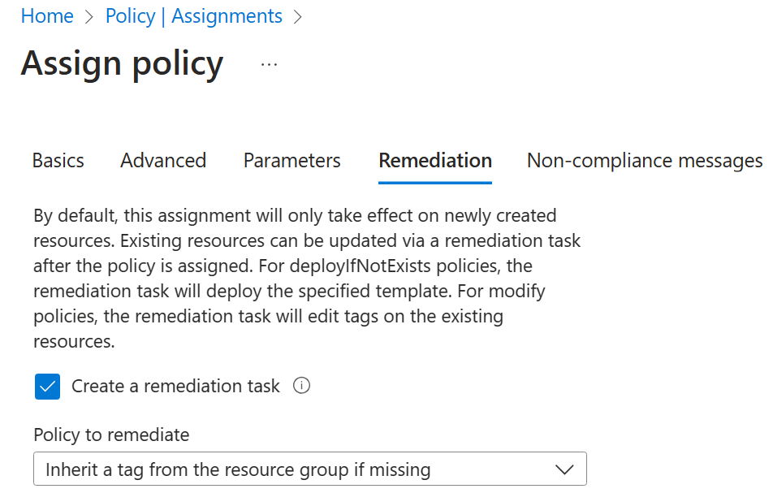

---
lab:
  title: 'Lab 02b: Mengelola Tata Kelola melalui Azure Policy'
  module: Administer Governance and Compliance
---

# Lab 02b - Mengelola Tata Kelola melalui Azure Policy

## Pengenalan lab

Di lab ini, Anda mempelajari cara menerapkan rencana tata kelola organisasi Anda. Anda mempelajari bagaimana kebijakan Azure dapat memastikan keputusan operasional diberlakukan di seluruh organisasi. Anda mempelajari cara menggunakan pemberian tag sumber daya untuk meningkatkan pelaporan. 

Lab ini memerlukan langganan Azure. Jenis langganan Anda dapat memengaruhi ketersediaan fitur di lab ini. Anda dapat mengubah wilayah, tetapi langkah-langkahnya ditulis menggunakan **US** Timur. 

## Perkiraan waktu: 30 menit

## Skenario lab

Jejak cloud organisasi Anda telah berkembang pesat dalam setahun terakhir. Selama audit baru-baru ini, Anda menemukan sejumlah besar sumber daya yang tidak memiliki pemilik, proyek, atau pusat biaya yang ditentukan. Untuk meningkatkan manajemen sumber daya Azure di organisasi Anda, Anda memutuskan untuk menerapkan fungsionalitas berikut:

- menerapkan tag sumber daya untuk melampirkan metadata penting ke sumber daya Azure

- menerapkan penggunaan tag sumber daya untuk sumber daya baru dengan menggunakan kebijakan Azure

- memperbarui sumber daya yang ada dengan tag sumber daya

- menggunakan kunci sumber daya untuk melindungi sumber daya yang dikonfigurasi

## Simulasi lab interaktif

Ada beberapa simulasi lab interaktif yang mungkin berguna bagi Anda untuk topik ini. Simulasi ini memungkinkan Anda mengklik skenario serupa dengan kecepatan Anda sendiri. Ada perbedaan antara simulasi interaktif dan lab ini, tetapi banyak konsep intinya sama. Langganan Azure tidak diperlukan. 

+ [Mengelola kunci](https://mslearn.cloudguides.com/en-us/guides/AZ-900%20Exam%20Guide%20-%20Azure%20Fundamentals%20Exercise%2015) sumber daya. Tambahkan kunci sumber daya dan uji untuk mengonfirmasi.
  
+ [Membuat kebijakan](https://mslearn.cloudguides.com/en-us/guides/AZ-900%20Exam%20Guide%20-%20Azure%20Fundamentals%20Exercise%2017) Azure. Buat kebijakan Azure yang membatasi sumber daya lokasi dapat ditemukan. Buat sumber daya baru dan pastikan kebijakan diberlakukan. 

+ [Mengelola tata kelola melalui kebijakan](https://mslabs.cloudguides.com/guides/AZ-104%20Exam%20Guide%20-%20Microsoft%20Azure%20Administrator%20Exercise%203) Azure. Buat dan tetapkan tag melalui portal Azure. Buat kebijakan Azure yang memerlukan pemberian tag. Memulihkan sumber daya yang tidak sesuai.

## Diagram arsitektur

## Keterampilan pekerjaan

+ Tugas 1: Buat dan tetapkan tag melalui portal Azure.
+ Tugas 2: Menerapkan pemberian tag melalui Azure Policy.
+ Tugas 3: Terapkan pemberian tag melalui Azure Policy.
+ Tugas 4: Mengonfigurasi dan menguji kunci sumber daya. 

## Tugas 1: Menetapkan tag melalui portal Azure

Dalam tugas ini, Anda akan membuat dan menetapkan tag ke grup sumber daya Azure melalui portal Microsoft Azure. Tag adalah komponen penting dari strategi tata kelola seperti yang diuraikan oleh Microsoft Well-Architected Framework dan Cloud Adoption Framework. Tag dapat memungkinkan Anda mengidentifikasi pemilik sumber daya, tanggal matahari terbenam, kontak grup, dan pasangan nama/nilai lainnya yang dianggap penting oleh organisasi Anda. Untuk tugas ini, Anda menetapkan tag yang mengidentifikasi peran sumber daya ('Infra' untuk 'Infrastruktur').

1. Masuk ke **portal Microsoft Azure** - `https://portal.azure.com`.
      
1. Cari dan pilih `Resource groups`.

1. Dari Grup sumber daya, pilih **+ Buat**.

    | Pengaturan | Nilai |
    | --- | --- |
    | Nama langganan | langganan Anda |
    | Nama grup sumber daya | `az104-rg2` |
    | Lokasi | **US Timur** |

    >**Catatan:** Untuk setiap lab dalam kursus ini, Anda akan membuat grup sumber daya baru. Ini memungkinkan Anda dengan cepat menemukan dan mengelola sumber daya lab Anda. 

1. Pilih **Berikutnya: Tag** dan buat tag baru.

    | Pengaturan | Nilai |
    | --- | --- |
    | Nama | `Cost Center` |
    | Nilai | `000` |

1. Pilih **Tinjauan + Buat**, kemudian pilih **Buat**.

## Tugas 2: Menerapkan pemberian tag melalui Azure Policy

Dalam tugas ini, Anda akan menetapkan *bawaan Memerlukan tag dan nilainya pada kebijakan sumber daya* ke grup sumber daya dan mengevaluasi hasilnya. Azure Policy dapat digunakan untuk menerapkan konfigurasi, dan dalam hal ini, tata kelola, ke sumber daya Azure Anda. 

1. Di portal Azure, cari dan pilih `Policy`. 

1. Di bilah **Penulisan** , pilih **Definisi**. Luangkan waktu sejenak untuk menelusuri daftar definisi[ kebijakan bawaan ](https://learn.microsoft.com/azure/governance/policy/samples/built-in-policies)yang tersedia untuk Anda gunakan. Perhatikan bahwa Anda juga dapat mencari definisi.

    

1. Klik entri yang mewakili kebijakan bawaan **Memerlukan tag dan nilainya pada sumber daya** . Luangkan waktu semenit untuk meninjau definisi. 

1. Pada panel **Memerlukan tag dan nilainya pada definisi** kebijakan bawaan sumber daya, klik **Tetapkan**.

1. **Tentukan Cakupan** dengan mengklik tombol elipsis dan memilih nilai berikut. Klik **Pilih** saat Anda selesai. 

    | Pengaturan | Nilai |
    | --- | --- |
    | Langganan | *langganan Anda* |
    | Grup Sumber Daya | **az104-rg2** |

    >**Catatan**: Anda dapat menetapkan kebijakan pada tingkat grup manajemen, langganan, atau grup sumber daya. Anda juga memiliki opsi untuk menentukan pengecualian, seperti langganan individual, grup sumber daya, atau sumber daya. Dalam skenario ini, kami menginginkan tag pada semua sumber daya dalam grup sumber daya.

1. Konfigurasikan properti **Dasar** penugasan dengan menentukan pengaturan berikut (biarkan yang lain dengan defaultnya):

    | Pengaturan | Nilai |
    | --- | --- |
    | Nama penetapan | `Require Cost Center tag with Default value`|
    | Deskripsi | `Require Cost Center tag with default value for all resources in the resource group`|
    | Pemberlakuan kebijakan | Diaktifkan |

    >**Catatan**: Nama **** Penugasan secara otomatis diisi dengan nama kebijakan yang Anda pilih, tetapi Anda dapat mengubahnya. **Deskripsi** bersifat opsional. Perhatikan bahwa Anda dapat menonaktifkan kebijakan kapan saja. 

1. Klik **Berikutnya** dua kali dan atur **Parameter** ke nilai berikut:

    | Pengaturan | Nilai |
    | --- | --- |
    | Nama Tag | `Cost Center` |
    | Nilai Tag | `000` |

1. Klik **Berikutnya** dan tinjau tab **Remediasi** . Biarkan kotak **centang Buat Identitas** Terkelola tidak dicentang. 

1. Klik **Tinjau + Buat**, lalu klik **Buat**.

    >**Catatan**: Sekarang Anda akan memverifikasi bahwa penetapan kebijakan baru berlaku dengan mencoba membuat akun Azure Storage di grup sumber daya. Anda akan membuat akun penyimpanan tanpa menambahkan tag yang diperlukan. 
    
    >**Catatan**: Mungkin diperlukan waktu antara 5 dan 10 menit agar kebijakan diterapkan.

1. Di portal, cari dan pilih `Storage Account`, dan pilih **+ Buat**. 

1. Pada tab **Dasar** dari bilah **Buat akun** penyimpanan, selesaikan konfigurasi.

    | Pengaturan | Nilai |
    | --- | --- |
    | Grup sumber daya | **az104-rg2** |
    | Nama akun penyimpanan | *kombinasi unik global antara 3 dan 24 huruf kecil dan digit, dimulai dengan huruf* |

1. Pilih **Tinjau** lalu klik **Buat**.

1. Anda akan menerima **pesan Validasi gagal** . Lihat pesan untuk mengidentifikasi alasan kegagalan. Verifikasi pesan kesalahan menyatakan bahwa penyebaran sumber daya tidak diizinkan oleh kebijakan. 

     

>**Catatan**: Dengan mengklik tab **Kesalahan** Mentah, Anda dapat menemukan detail selengkapnya tentang kesalahan, termasuk nama definisi **peran Memerlukan tag Pusat Biaya dengan nilai** Default. Penyebaran gagal karena akun penyimpanan yang Anda coba buat tidak memiliki tag bernama **Pusat** Biaya dengan nilainya diatur ke **Default**.

## Tugas 3: Menerapkan pemberian tag melalui kebijakan Azure

Dalam tugas ini, kita akan menggunakan definisi kebijakan baru untuk memulihkan sumber daya yang tidak sesuai. Dalam skenario ini, kami akan membuat sumber daya anak dari grup sumber daya mewarisi **tag Pusat** Biaya yang ditentukan pada grup sumber daya.

1. Di portal Azure, cari dan pilih `Policy`. 

1. Di bagian **Authoring**, klik **Tugas**. 

1. Dalam daftar tugas, klik ikon elipsis di baris yang mewakili **tag Memerlukan Pusat Biaya dengan penetapan kebijakan nilai** Default dan gunakan **item menu Hapus penugasan** untuk menghapus penugasan.

1. Klik **Tetapkan kebijakan** dan tentukan **Cakupan** dengan mengeklik tombol elipsis dan memilih nilai berikut:

    | Pengaturan | Nilai |
    | --- | --- |
    | Langganan | langganan Azure Anda |
    | Grup Sumber Daya | `az104-rg2` |

1. Untuk menentukan **Definisi kebijakan**, klik tombol elipsis lalu cari dan pilih `Inherit a tag from the resource group if missing`.

1. Pilih **Tambahkan** lalu konfigurasikan properti Dasar** yang tersisa **dari penugasan.

    | Pengaturan | Nilai |
    | --- | --- |
    | Nama penetapan | `Inherit the Cost Center tag and its value 000 from the resource group if missing` |
    | Deskripsi | `Inherit the Cost Center tag and its value 000 from the resource group if missing` |
    | Pemberlakuan kebijakan | Diaktifkan |

1. Klik **Berikutnya** dua kali dan atur **Parameter** ke nilai berikut:

    | Pengaturan | Nilai |
    | --- | --- |
    | Nama Tag | `Cost Center` |

1. Klik **Berikutnya** dan, pada tab **Perbaikan**, konfigurasikan setelan berikut (biarkan yang lain dengan default):

    | Pengaturan | Nilai |
    | --- | --- |
    | Buat tugas remediasi | diaktifkan |
    | Kebijakan yang akan diremediasi | **Mewarisi tag dari grup sumber daya jika tidak ada** |

    >**Catatan**: Definisi kebijakan ini mencakup **efek Ubah** . Jadi, identitas terkelola diperlukan. 

     

1. Klik **Tinjau + Buat**, lalu klik **Buat**.

    >**Catatan**: Untuk memverifikasi bahwa penetapan kebijakan baru berlaku, Anda akan membuat akun penyimpanan Azure lain di grup sumber daya yang sama tanpa secara eksplisit menambahkan tag yang diperlukan. 
    
    >**Catatan**: Mungkin diperlukan waktu antara 5 dan 10 menit agar kebijakan diterapkan.

1. Cari dan pilih `Storage Account`, dan klik **+ Buat**. 

1. Pada tab **Dasar dari bilah **Buat akun** penyimpanan, verifikasi bahwa Anda menggunakan Grup Sumber Daya tempat Kebijakan diterapkan dan tentukan pengaturan berikut (biarkan orang lain dengan defaultnya) dan klik **Tinjau**:**

    | Pengaturan | Nilai |
    | --- | --- |
    | Nama akun penyimpanan | *kombinasi unik global antara 3 dan 24 huruf kecil dan digit, dimulai dengan huruf* |

1. Verifikasi bahwa kali ini validasi lulus dan klik **Buat**.

1. Setelah akun penyimpanan baru disediakan, klik **Buka sumber daya**.

1. Pada bilah **Tag** , perhatikan bahwa tag **Pusat** Biaya dengan nilai **000** telah ditetapkan secara otomatis ke sumber daya.

    >**Apakah Anda tahu?** Jika Anda mencari dan memilih **Tag** di portal, Anda dapat melihat sumber daya dengan tag tertentu. 

## Tugas 4: Mengonfigurasi dan menguji kunci sumber daya

Dalam tugas ini, Anda mengonfigurasi dan menguji kunci sumber daya. Kunci mencegah penghapusan atau modifikasi sumber daya. 

1. Cari dan pilih grup sumber daya Anda.
   
1. Di bilah **Pengaturan**, pilih **Kunci**.

1. Pilih **Tambahkan** dan lengkapi informasi kunci sumber daya. Setelah selesai pilih **Ok**. 

    | Pengaturan | Nilai |
    | --- | --- |
    | Nama kunci | `rg-lock` |
    | Jenis kunci | **hapus** (perhatikan pilihan untuk baca-saja) |
    
1. Navigasi ke bilah Gambaran Umum** grup **sumber daya, dan pilih **Hapus grup** sumber daya.

1. Di kotak **teks Masukkan nama grup sumber daya untuk mengonfirmasi penghapusan** , berikan nama grup sumber daya, `az104-rg2`. Perhatikan bahwa Anda dapat menyalin dan menempelkan nama grup sumber daya. 

1. Perhatikan peringatan: Menghapus grup sumber daya ini dan sumber daya dependennya adalah tindakan permanen dan tidak dapat dibatalkan. Pilih **Hapus**.

1. Anda harus menerima pemberitahuan yang menolak penghapusan. 

     

## Membersihkan sumber daya Anda

Jika Anda bekerja dengan **langganan** Anda sendiri membutuhkan waktu satu menit untuk menghapus sumber daya lab. Ini akan memastikan sumber daya dibebankan dan biaya diminimalkan. Cara term mudah untuk menghapus sumber daya lab adalah dengan menghapus grup sumber daya lab. 

+ Di portal Azure, pilih grup sumber daya, pilih **Hapus grup** sumber daya, **Masukkan nama** grup sumber daya, lalu klik **Hapus**.
+ Menggunakan Azure PowerShell, `Remove-AzResourceGroup -Name resourceGroupName`.
+ Menggunakan CLI, `az group delete --name resourceGroupName`.

## Poin penting

Selamat atas penyelesaian lab. Berikut adalah takeaway utama untuk lab ini. 

+ Tag Azure adalah metadata yang terdiri dari pasangan kunci-nilai. Tag menjelaskan sumber daya tertentu di lingkungan Anda. Secara khusus, pemberian tag di Azure memungkinkan Anda memberi label sumber daya Anda secara logis.
+ Azure Policy menetapkan konvensi untuk sumber daya. Definisi kebijakan menjelaskan kondisi kepatuhan sumber daya dan efek yang harus diambil jika kondisi terpenuhi. Kondisi membandingkan bidang properti sumber daya atau nilai dengan nilai yang diperlukan. Ada banyak definisi kebijakan bawaan dan Anda dapat menyesuaikan kebijakan. 
+ Fitur tugas remediasi Azure Policy digunakan untuk membawa sumber daya ke kepatuhan berdasarkan definisi dan penugasan. Sumber daya yang tidak sesuai dengan penetapan definisi modifikasi atau deployIfNotExist, dapat dibawa ke kepatuhan menggunakan tugas remediasi.
+ Anda dapat mengonfigurasi kunci sumber daya pada langganan, grup sumber daya, atau sumber daya. Kunci dapat melindungi sumber daya dari penghapusan dan modifikasi pengguna yang tidak disengaja. Kunci menimpa izin pengguna apa pun.
+ Azure Policy adalah praktik keamanan pra-penyebaran. RBAC dan kunci sumber daya adalah praktik keamanan pasca-penyebaran. 

## Pelajari lebih lanjut dengan pelatihan mandiri

+ [Merancang strategi](https://learn.microsoft.com/training/modules/enterprise-governance/) tata kelola perusahaan. Gunakan RBAC dan Azure Policy untuk membatasi akses ke solusi Azure Anda, dan tentukan metode mana yang tepat untuk tujuan keamanan Anda.
  

