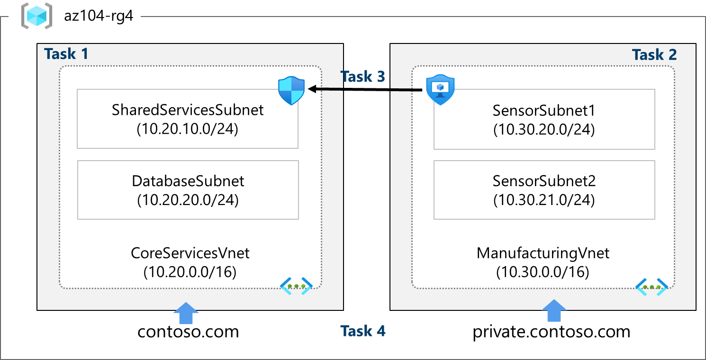

---
lab:
  title: 'Lab 04: Mengimplementasikan Jaringan Virtual'
  module: Implement Virtual Networking
---

# Lab 04 - Menerapkan Virtual Network

## Pengantar lab

Lab ini adalah lab pertama dari tiga lab yang berfokus pada jaringan virtual. Dalam lab ini, Anda akan mempelajari dasar-dasar jaringan virtual dan subnet. Anda akan mempelajari cara melindungi jaringan Anda dengan kelompok keamanan jaringan dan kelompok keamanan aplikasi. Anda juga mempelajari tentang zona dan catatan DNS. 

Lab ini memerlukan langganan Azure. Tipe langganan Anda dapat memengaruhi ketersediaan fitur di lab ini. Anda dapat mengubah wilayah, tetapi langkah-langkah dalam lab ini ditulis menggunakan **US Timur**.

## Perkiraan waktu: 50 menit

## Skenario lab 

Organisasi global berencana untuk mengimplementasikan jaringan virtual. Tujuan langsungnya adalah untuk mengakomodasi semua sumber daya yang ada. Namun, organisasi sedang dalam fase pertumbuhan dan ingin memastikan ada kapasitas tambahan untuk pertumbuhan tersebut.

Jaringan virtual **CoreServicesVnet** memiliki jumlah sumber daya terbesar. Sejumlah besar pertumbuhan diantisipasi, sehingga ruang alamat besar diperlukan untuk jaringan virtual ini.

Jaringan virtual **ManufacturingVnet** berisi sistem untuk operasi fasilitas manufaktur. Organisasi mengantisipasi sejumlah besar perangkat terhubung internal tempat sistem mereka dapat mengambil data. 

## Simulasi lab interaktif

Ada beberapa simulasi lab interaktif yang mungkin berguna bagi Anda untuk topik ini. Simulasi ini memungkinkan Anda mengeklik skenario serupa secara mandiri. Ada perbedaan antara simulasi interaktif dan lab ini, tetapi banyak konsep intinya sama. Langganan Azure tidak diperlukan. 

+ [Amankan lalu lintas jaringan](https://mslearn.cloudguides.com/en-us/guides/AZ-900%20Exam%20Guide%20-%20Azure%20Fundamentals%20Exercise%2013). Buat mesin virtual, jaringan virtual, dan kelompok keamanan jaringan. Tambahkan aturan kelompok keamanan jaringan untuk memperbolehkan dan melarang lalu lintas.
  
+ [Buat jaringan virtual sederhana](https://mslearn.cloudguides.com/en-us/guides/AZ-900%20Exam%20Guide%20-%20Azure%20Fundamentals%20Exercise%204). Buat jaringan virtual dengan dua mesin virtual. Tunjukkan bahwa mesin virtual dapat berkomunikasi. 

+ [Desain dan implementasikan jaringan virtual di Azure](https://mslabs.cloudguides.com/guides/AZ-700%20Lab%20Simulation%20-%20Design%20and%20implement%20a%20virtual%20network%20in%20Azure). Buat grup sumber daya dan buat jaringan virtual dengan subnet.  

+ [Implementasikan jaringan virtual](https://mslabs.cloudguides.com/en-us/guides/AZ-104%20Exam%20Guide%20-%20Microsoft%20Azure%20Administrator%20Exercise%208). Buat dan konfigurasikan jaringan virtual, sebarkan mesin virtual, konfigurasikan kelompok keamanan jaringan, dan konfigurasikan Azure DNS.

## Diagram arsitektur



Jaringan virtual dan subnet ini disusun sedemikian rupa sehingga dapat mengakomodasi sumber daya yang ada, tetapi memungkinkan untuk pertumbuhan yang diproyeksikan. Mari kita buat jaringan virtual dan subnet ini untuk meletakkan fondasi untuk infrastruktur jaringan kita.

>**Tahukah Anda?**: Menghindari rentang alamat IP yang tumpang tindih merupakan praktik yang baik untuk mengurangi masalah dan menyederhanakan pemecahan masalah. Tumpang tindih adalah masalah di seluruh jaringan, baik di cloud maupun lokal. Banyak organisasi mendesain skema penetapan alamat IP seluruh perusahaan untuk menghindari tumpang tindih dan merencanakan pertumbuhan di masa mendatang.

## Keterampilan pekerjaan

+ Tugas 1: Buat jaringan virtual dengan subnet menggunakan portal.
+ Tugas 2: Buat jaringan virtual dan subnet menggunakan templat.
+ Tugas 3: Buat dan konfigurasikan komunikasi antara Kelompok Keamanan Aplikasi dan Kelompok Keamanan Jaringan.
+ Tugas 4: Konfigurasikan zona Azure DNS publik dan privat.
  
## Tugas 1: Membuat jaringan virtual dengan subnet menggunakan portal

Organisasi merencanakan pertumbuhan besar untuk layanan inti. Dalam tugas ini, Anda akan membuat jaringan virtual dan subnet terkait untuk mengakomodasi sumber daya yang ada dan pertumbuhan yang direncanakan. Dalam tugas ini, Anda akan menggunakan portal Azure. 

1. Masuk ke **portal Azure** - `https://portal.azure.com`.
   
1. Cari dan pilih `Virtual Networks`.

1. Pilih **Buat** pada halaman Jaringan virtual.

1. Selesaikan tab **Dasar** untuk CoreServicesVnet.  

    |  **Opsi**         | **Nilai**            |
    | ------------------ | -------------------- |
    | Grup Sumber Daya     | `az104-rg4` (jika perlu, buat baru) |
    | Nama               | `CoreServicesVnet`     |
    | Wilayah             | (AS) **US Timur**         |

1. Pindah ke tab **Alamat IP**.

    |  **Opsi**         | **Nilai**            |
    | ------------------ | -------------------- |
    | Ruang alamat IPv4 | Ganti ruang alamat IPv4 yang telah diisi sebelumnya dengan `10.20.0.0/16` (pisahkan entri)  |

1. Pilih **+ Tambahkan subnet**. Lengkapi informasi nama dan alamat untuk setiap subnet. Pastikan Anda memilih **Tambahkan** untuk setiap subnet baru. Pastikan untuk menghapus subnet default - baik sebelum atau sesudah membuat subnet lainnya.

    | **Subnet**             | **Opsi**           | **Nilai**              |
    | ---------------------- | -------------------- | ---------------------- |
    | SharedServicesSubnet   | Nama subnet          | `SharedServicesSubnet`   |
    |                        | Alamat awal     | `10.20.10.0`          |
    |                        | Ukuran                 | `/24` |
    | DatabaseSubnet         | Nama subnet          | `DatabaseSubnet`         |
    |                        | Alamat awal     | `10.20.20.0`        |
    |                        | Ukuran                 | `/24` |

    >**Catatan:** Setiap jaringan virtual harus memiliki setidaknya satu subnet. Pengingat bahwa lima alamat IP akan selalu dicadangkan, jadi pertimbangkan hal itu dalam perencanaan Anda. 

1. Untuk menyelesaikan pembuatan CoreServicesVnet dan subnet terkait, pilih **Tinjau + buat**.

1. Verifikasi konfigurasi Anda lulus validasi, lalu pilih **Buat**.

1. Tunggu jaringan virtual disebarkan lalu pilih **Buka sumber daya**.

1. Luangkan waktu sebentar untuk memverifikasi **Ruang alamat** dan **Subnet**. Perhatikan pilihan Anda lain di blade **Pengaturan**. 

1. Di bagian **Automation**, pilih **Ekspor templat**, lalu tunggu templat dibuat.

1. **Unduh** templat.

1. Navigasikan di komputer lokal ke folder **Unduhan** dan **Ekstrak semua** file dalam file zip yang diunduh. 

1. Sebelum melanjutkan, pastikan Anda memiliki file **template.json**. Anda akan menggunakan templat ini untuk membuat ManufacturingVnet di tugas berikutnya. 
 
## Tugas 2: Membuat jaringan virtual dan subnet menggunakan templat

Dalam tugas ini, Anda akan membuat jaringan virtual ManufacturingVnet dan subnet terkait. Organisasi mengantisipasi pertumbuhan untuk kantor manufaktur sehingga ukuran subnet disesuaikan untuk pertumbuhan yang diharapkan. Untuk tugas ini, Anda akan menggunakan templat untuk membuat sumber daya. 

1. Temukan file **template.json** yang diekspor di tugas sebelumnya. Itu seharusnya berada di folder **Unduhan** Anda.

1. Sunting file menggunakan penyunting pilihan Anda. Banyak penyunting memiliki fitur *ubah semua kemunculan*. Jika Anda menggunakan Visual Studio Code, pastikan Anda bekerja dalam **jendela tepercaya** dan bukan dalam **mode terbatas**. Lihat diagram arsitektur untuk memverifikasi detailnya. 

### Membuat perubahan untuk jaringan virtual ManufacturingVnet

1. Ganti semua kemunculan **CoreServicesVnet** dengan `ManufacturingVnet`. 

1. Ganti semua kemunculan **10.20.0.0** dengan `10.30.0.0`. 

### Membuat perubahan untuk subnet ManufacturingVnet

1. Ubah semua kemunculan **SharedServicesSubnet** menjadi `SensorSubnet1`.

1. Ubah semua kemunculan **10.20.10.0/24** menjadi `10.30.20.0/24`.

1. Ubah semua kemunculan **DatabaseSubnet** menjadi `SensorSubnet2`.

1. Ubah semua kemunculan **10.20.20.0/24** menjadi `10.30.21.0/24`.

1. Baca kembali file dan pastikan semuanya terlihat benar.

1. Pastikan untuk **Menyimpan** perubahan Anda.

>**Catatan:** Ada file templat yang sudah selesai di direktori file lab. 

### Membuat perubahan pada file parameter

1. Temukan file **parameters.json** yang diekspor di tugas sebelumnya. Itu seharusnya berada di folder **Unduhan** Anda.

1. Sunting file menggunakan penyunting pilihan Anda.

1. Ganti satu kemunculan **CoreServicesVnet** dengan `ManufacturingVnet`.

1. **Simpan** perubahan Anda.
   
### Menyebarkan templat kustom

1. Di portal, cari dan pilih **Sebarkan templat kustom**.

1. Pilih **Bangun templat Anda sendiri di penyunting** lalu **Muat file**.

1. Pilih file **templates.json** dengan perubahan Manufaktur, lalu pilih **Simpan**.

1. Pilih **Ulas + buat**, lalu pilih **Buat**.

1. Tunggu hingga templat disebarkan, lalu konfirmasi (di portal) bahwa jaringan virtual dan subnet Manufaktur telah dibuat.

>**Catatan:** Jika Anda harus menyebarkan lebih dari satu kali, Anda mungkin mendapati beberapa sumber daya berhasil diselesaikan dan penyebarannya gagal. Anda dapat menghapus sumber daya tersebut secara manual dan mencoba lagi. 
   
## Tugas 3: Membuat dan mengonfigurasi komunikasi antara Kelompok Keamanan Aplikasi dan Kelompok Keamanan Jaringan

Dalam tugas ini, kita akan membuat Kelompok Keamanan Aplikasi dan Kelompok Keamanan Jaringan. NSG akan memiliki aturan keamanan masuk yang memperbolehkan lalu lintas dari ASG. NSG juga akan memiliki aturan keluar yang menolak akses ke internet. 

### Membuat Kelompok Keamanan Aplikasi (ASG)

1. Di portal Azure, cari dan pilih `Application security groups`.

1. Klik **Buat** dan berikan informasi dasar.

    | Pengaturan | Nilai |
    | -- | -- |
    | Langganan | *langganan Anda* |
    | Grup sumber daya | **az104-rg4** |
    | Nama | `asg-web` |
    | Wilayah | **US Timur**  |

1. Klik **Tinjau + buat** dan setelah validasi klik **Buat**.

### Membuat Kelompok Keamanan Jaringan dan mengasosiasikan dengan subnet ASG

1. Di portal Azure, cari dan pilih `Network security groups`.

1. Pilih **+ Buat** dan berikan informasi pada tab **Dasar**. 

    | Pengaturan | Nilai |
    | -- | -- |
    | Langganan | *langganan Anda* |
    | Grup sumber daya | **az104-rg4** |
    | Nama | `myNSGSecure` |
    | Wilayah | **US Timur**  |

1. Klik **Tinjau + buat** dan setelah validasi klik **Buat**.

1. Setelah NSG disebarkan, klik **Buka sumber daya**.

1. Di **Pengaturan**, klik **Subnet** lalu **Asosiasikan**.

    | Pengaturan | Nilai |
    | -- | -- |
    | Jaringan virtual | **CoreServicesVnet (az104-rg4)** |
    | Subnet | **SharedServicesSubnet** |

1. Klik **OK** untuk menyimpan asosiasi.

### Mengonfigurasi aturan keamanan masuk untuk memperbolehkan lalu lintas ASG

1. Lanjutkan bekerja dengan NSG Anda. Di area **Pengaturan**, pilih **Aturan keamanan masuk**.

1. Tinjau aturan masuk default. Perhatikan bahwa hanya jaringan virtual lain dan penyeimbang beban yang diperbolehkan mengakses.

1. Pilih **+ Tambah**.

1. Pada blade **Tambahkan aturan keamanan masuk**, gunakan informasi berikut untuk menambahkan aturan port masuk. Aturan ini memperbolehkan lalu lintas ASG. Setelah selesai, pilih **Tambahkan**.

    | Pengaturan | Nilai |
    | -- | -- |
    | Sumber | **Kelompok keamanan aplikasi** |
    | Kelompok keamanan aplikasi sumber | **asg-web** |
    | Source port ranges |  * |
    | Tujuan | **Mana pun** |
    | Layanan | **Kustom** (perhatikan pilihan lainnya) |
    | Rentang port tujuan | **80,443** |
    | Protokol | **TCP** |
    | Tindakan
           | **Izinkan** |
    | Prioritas | **100** |
    | Nama | `AllowASG` |

### Mengonfigurasi aturan NSG keluar yang menolak akses Internet

1. Setelah membuat aturan NSG masuk, pilih **Aturan keamanan keluar**. 

1. Perhatikan aturan **AllowInternetOutboundRule**. Perhatikan juga bahwa aturan ini tidak dapat dihapus dan prioritasnya adalah 65001.

1. Pilih **+ Tambahkan** lalu konfigurasikan aturan keluar yang menolak akses ke internet. Setelah selesai, pilih **Tambahkan**.

    | Pengaturan | Nilai |
    | -- | -- |
    | Sumber | **Mana pun** |
    | Source port ranges |  * |
    | Tujuan | **Tag layanan** |
    | Tag layanan tujuan | **Internet** |
    | Layanan | **Adat** |
    | Rentang port tujuan | **8080** |
    | Protokol | **Mana pun** |
    | Tindakan
           | **Tolak** |
    | Prioritas | **4096** |
    | Nama | **DenyAnyCustom8080Outbound** |


## Tugas 4: Mengonfigurasi zona Azure DNS publik dan privat

Dalam tugas ini, Anda akan membuat dan mengonfigurasi zona DNS publik dan privat. 

### Mengonfigurasi zona DNS publik

Anda bisa mengonfigurasi Azure DNS untuk meresolusi nama host di domain publik Anda. Sebagai contoh, jika Anda membeli nama domain contoso.xyz dari registrar nama domain, Anda dapat mengonfigurasi Azure DNS untuk meng-host domain `contoso.com` dan menetapkan www.contoso.xyz ke alamat IP server web atau aplikasi web Anda.

1. Di portal, cari dan pilih `DNS zones`.

1. Pilih **+ Buat.**

1. Konfigurasikan **Dasar**.

    | Properti | Nilai    |
    |:---------|:---------|
    | Langganan | **Pilih langganan Anda** |
    | Grup sumber daya | **az-104-rg4** |
    | Nama | `contoso.com` (jika telah dicadangkan, sesuaikan namanya) |
    | Wilayah |**US Timur** (tinjau ikon informasi) |

1. Pilih **Tinjau buat** lalu **Buat**.
   
1. Tunggu zona DNS disebarkan lalu pilih **Buka sumber daya**.

1. Pada blade **Gambaran Umum**, perhatikan nama empat server nama Azure DNS yang ditetapkan ke zona tersebut. **Salin** salah satu alamat server nama. Anda akan membutuhkannya di langkah berikutnya. 
  
1. Pilih **Kumpulan catatan**. Anda menambahkan catatan tautan jaringan virtual untuk setiap jaringan virtual yang membutuhkan dukungan resolusi nama privat.

    | Properti | Nilai    |
    |:---------|:---------|
    | Nama | **www** |
    | Jenis | **A** |
    | TTL | **1** |
    | Alamat IP | **10.1.1.4** |

>**Catatan:**  Dalam skenario dunia nyata, Anda akan memasukkan alamat IP publik server web Anda.

1. Pilih **OK** dan verifikasi **contoso.com** memiliki kumpulan catatan A bernama **www**.

1. Buka perintah dan jalankan perintah berikut:

   ```sh
   nslookup www.contoso.com <name server name>
   ```
1. Verifikasi bahwa nama host www.contoso.com ditetapkan ke alamat IP yang Anda berikan. Ini mengonfirmasi bahwa resolusi nama berfungsi dengan benar.

### Mengonfigurasi zona DNS privat

Zona DNS privat menyediakan layanan resolusi nama dalam jaringan virtual. Zona DNS privat hanya dapat diakses dari jaringan virtual yang ditautkan dan tidak dapat diakses dari internet. 

1. Di portal, cari dan pilih `Private dns zones`.

1. Pilih **+ Buat.**

1. Di tab **Dasar** pada Buat zona DNS privat, masukkan informasi seperti yang tercantum dalam tabel di bawah ini:

    | Properti | Nilai    |
    |:---------|:---------|
    | Langganan | **Pilih langganan Anda** |
    | Grup sumber daya | **az-104-rg4** |
    | Nama | `private.contoso.com` (sesuaikan jika Anda harus mengganti nama) |
    | Wilayah |**US Timur** |

1. Pilih **Tinjau buat** lalu **Buat**.
   
1. Tunggu zona DNS disebarkan lalu pilih **Buka sumber daya**.

1. Perhatikan pada blade **Gambaran Umum** tidak ada catatan server nama. 

1. Pilih **+ Tautan jaringan virtual** lalu pilih **+ Tambahkan**. 

    | Properti | Nilai    |
    |:---------|:---------|
    | Nama tautan | `manufacturing-link` |
    | Jaringan virtual | `ManufacturingVnet` |

1. Pilih **OK** dan tunggu hingga tautan dibuat. 

1. Dari blade **Gambaran Umum**, pilih **+ Kumpulan catatan**. Sekarang Anda akan menambahkan catatan untuk setiap mesin virtual yang membutuhkan dukungan resolusi nama privat.

    | Properti | Nilai    |
    |:---------|:---------|
    | Nama | **sensorvm** |
    | Jenis | **A** |
    | TTL | **1** |
    | Alamat IP | **10.1.1.4** |

 >**Catatan:**  Dalam skenario dunia nyata, Anda akan memasukkan alamat IP untuk mesin virtual manufaktur tertentu.

## Membersihkan sumber daya Anda

Jika Anda bekerja dengan **langganan Anda sendiri** luangkan waktu sebentar untuk menghapus sumber daya lab. Hal ini akan memastikan sumber daya dikosongkan dan biaya diminimalkan. Cara termudah untuk menghapus sumber daya lab adalah dengan menghapus grup sumber daya lab. 

+ Di portal Microsoft Azure, pilih grup sumber daya, pilih **Hapus grup sumber daya**, **Masukkan nama grup sumber daya**, lalu klik **Hapus**.
+ Menggunakan Azure PowerShell, `Remove-AzResourceGroup -Name resourceGroupName`.
+ Menggunakan CLI, `az group delete --name resourceGroupName`.

## Perluas pemelajaran Anda dengan Copilot

Copilot dapat membantu Anda mempelajari cara menggunakan alat pembuatan skrip Azure. Copilot juga dapat membantu di area yang tidak tercakup dalam lab atau ketika Anda memerlukan informasi lebih lanjut. Buka browser Edge dan pilih Copilot (kanan atas) atau navigasikan ke *copilot.microsoft.com*. Luangkan beberapa menit untuk mencoba perintah ini.
+ Bagikan 10 praktik terbaik saat menyebarkan dan mengonfigurasi jaringan virtual di Azure.
+ Bagaimana cara menggunakan perintah Azure PowerShell dan Azure CLI untuk membuat jaringan virtual dengan alamat IP publik dan satu subnet. 
+ Jelaskan aturan masuk dan keluar Kelompok Keamanan Jaringan Azure dan cara aturan tersebut digunakan.
+ Apa perbedaan antara Kelompok Keamanan Jaringan Azure dan Kelompok Keamanan Aplikasi Azure? Bagikan contoh waktu penggunaan masing-masing kelompok ini. 
+ Berikan panduan langkah demi langkah tentang cara memecahkan masalah jaringan apa pun yang kami hadapi saat menyebarkan jaringan di Azure. Bagikan juga proses pemikiran yang digunakan untuk setiap langkah pemecahan masalah.

## Pelajari lebih lanjut dengan pelatihan mandiri

+ [Pengantar Azure Virtual Network](https://learn.microsoft.com/training/modules/introduction-to-azure-virtual-networks/). Desain dan implementasikan infrastruktur Jaringan Azure inti seperti jaringan virtual, IP publik dan privat, DNS, peering jaringan virtual, perutean, dan Azure Virtual NAT.
+ [Desain skema penetapan alamat IP](https://learn.microsoft.com/training/modules/design-ip-addressing-for-azure/). Identifikasi kemampuan penetapan alamat IP privat dan publik jaringan virtual Azure dan lokal.
+ [Amankan dan isolasi akses ke sumber daya Azure dengan menggunakan kelompok keamanan jaringan dan titik akhir layanan](https://learn.microsoft.com/training/modules/secure-and-isolate-with-nsg-and-service-endpoints/). Grup keamanan jaringan dan titik akhir layanan membantu Anda mengamankan komputer virtual dan layanan Azure dari akses jaringan yang tidak sah.
+ [Host domain Anda di Azure DNS](https://learn.microsoft.com/training/modules/host-domain-azure-dns/). Membuat zona DNS untuk nama domain Anda. Buat catatan DNS untuk memetakan domain ke alamat IP. Uji apakah nama domain tersebut ditetapkan ke server web Anda.
  
## Poin penting

Selamat atas penyelesaian lab ini. Berikut adalah kesimpulan utama lab ini. 

+ Jaringan virtual adalah representasi jaringan Anda sendiri di cloud. 
+ Saat mendesain jaringan virtual, praktik yang baik adalah menghindari rentang alamat IP yang tumpang tindih. Ini akan mengurangi masalah dan menyederhanakan pemecahan masalah.
+ Subnet adalah rangkaian alamat IP di jaringan virtual. Anda dapat membagi jaringan virtual menjadi beberapa subnet untuk organisasi dan keamanan.
+ Kelompok keamanan jaringan berisi aturan keamanan yang memperbolehkan atau menolak lalu lintas jaringan. Ada aturan masuk dan keluar default yang dapat Anda sesuaikan dengan kebutuhan Anda.
+ Kelompok keamanan aplikasi digunakan untuk melindungi kelompok server dengan fungsi yang sama, seperti server web atau server database.
+ Azure DNS adalah layanan hosting untuk domain DNS yang menyediakan resolusi nama. Anda bisa mengonfigurasi Azure DNS untuk meresolusi nama host di domain publik Anda.  Anda juga dapat menggunakan zona DNS privat untuk menetapkan nama DNS ke mesin virtual (VM) di jaringan virtual Azure Anda.
