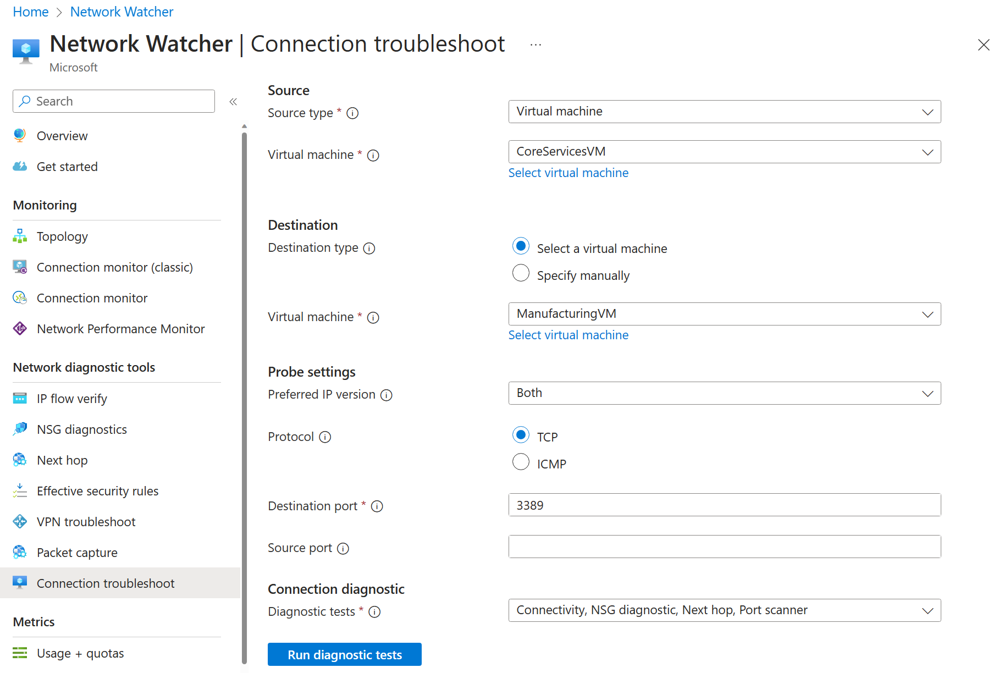

---
lab:
  title: 'Lab 05: Menerapkan intersite Koneksi ivity'
  module: Administer Intersite Connectivity
---

# Lab 05 - Menerapkan Konektivitas Antar Situs

## Pengenalan lab

Di lab ini Anda menjelajahi komunikasi antara jaringan virtual. Anda menerapkan peering jaringan virtual dan menguji koneksi. Anda juga akan membuat rute kustom. 

Lab ini memerlukan langganan Azure. Jenis langganan Anda dapat memengaruhi ketersediaan fitur di lab ini. Anda dapat mengubah wilayah, tetapi langkah-langkahnya ditulis menggunakan **US** Timur. 

## Perkiraan waktu: 50 menit
    
## Skenario lab 

Organisasi Anda mengegmentasi aplikasi dan layanan IT inti (seperti DNS dan layanan keamanan) dari bagian lain dari bisnis, termasuk departemen manufaktur Anda. Namun, dalam beberapa skenario, aplikasi dan layanan di area inti perlu berkomunikasi dengan aplikasi dan layanan di area manufaktur. Di lab ini, Anda mengonfigurasi konektivitas antara area tersegmentasi. Ini adalah skenario umum untuk memisahkan produksi dari pengembangan atau memisahkan satu anak perusahaan dari anak perusahaan lainnya.  

## Simulasi lab interaktif

Ada beberapa simulasi lab interaktif yang mungkin berguna bagi Anda untuk topik ini. Simulasi ini memungkinkan Anda mengklik skenario serupa dengan kecepatan Anda sendiri. Ada perbedaan antara simulasi interaktif dan lab ini, tetapi banyak konsep intinya sama. Langganan Azure tidak diperlukan. 

+ [Koneksi dua jaringan virtual Azure menggunakan peering](https://mslabs.cloudguides.com/guides/AZ-700%20Lab%20Simulation%20-%20Connect%20two%20Azure%20virtual%20networks%20using%20global%20virtual%20network%20peering) jaringan virtual global. Uji koneksi antara dua komputer virtual di jaringan virtual yang berbeda. Buat peering jaringan virtual dan coba lagi.

+ [Mengonfigurasi pemantauan untuk jaringan](https://learn.microsoft.com/training/modules/configure-monitoring-virtual-networks/) virtual. Pahami cara menggunakan Azure Network Watcher Koneksi ion Monitor, log alur, diagnostik NSG, dan pengambilan paket untuk memantau konektivitas di seluruh sumber daya jaringan Azure IaaS Anda.

+ [Menerapkan konektivitas](https://mslabs.cloudguides.com/en-us/guides/AZ-104%20Exam%20Guide%20-%20Microsoft%20Azure%20Administrator%20Exercise%209) antarsitus. Jalankan templat untuk membuat infrastruktur jaringan virtual dengan beberapa komputer virtual. Konfigurasikan peering jaringan virtual dan uji koneksi. 

## Diagram arsitektur


## Keterampilan pekerjaan

+ Tugas 1: Buat komputer virtual di jaringan virtual.
+ Tugas 2: Buat komputer virtual di jaringan virtual yang berbeda.
+ Tugas 3: Gunakan Network Watcher untuk menguji koneksi antara komputer virtual. 
+ Tugas 4: Mengonfigurasi peering jaringan virtual antara jaringan virtual yang berbeda.
+ Tugas 5: Gunakan Azure PowerShell untuk menguji koneksi antara komputer virtual.
+ Tugas 6: Buat rute kustom. 

## Tugas 1: Membuat komputer virtual layanan inti dan jaringan virtual

Dalam tugas ini, Anda membuat jaringan virtual layanan inti dengan komputer virtual. 

1. Masuk ke **portal Azure** - `https://portal.azure.com`.

1. Cari dan pilih `Virtual Machines`.

1. Dari halaman komputer virtual, pilih **Buat lalu pilih **Azure Virtual Machine****.

1. Pada tab Dasar, gunakan informasi berikut untuk melengkapi formulir, lalu pilih **Berikutnya: Disk >**. Untuk pengaturan apa pun yang tidak ditentukan, biarkan nilai default.
 
    | Pengaturan | Nilai | 
    | --- | --- |
    | Langganan |  *langganan Anda* |
    | Grup sumber daya |  `az104-rg5` (Jika perlu, **Buat baru**. )
    | Nama komputer virtual |    `CoreServicesVM` |
    | Wilayah | **(AS) AS Timur** |
    | Opsi ketersediaan | Tidak ada redundansi infrastruktur yang diperlukan |
    | Jenis keamanan | **Standard**
           |
    | Gambar | **Pusat Data Windows Server 2019: x64 Gen2** (perhatikan pilihan Anda yang lain) |
    | Ukuran | **Standard_DS2_v3** |
    | Nama Pengguna | `localadmin` | 
    | Kata sandi | **Berikan kata sandi yang kompleks** |
    | Port masuk publik | **Tidak** |

    
   
1. Pada tab **Disk** , ambil default lalu pilih **Berikutnya: Jaringan >**.

1. Pada tab **Jaringan** , untuk Jaringan virtual, pilih **Buat baru**.

1. Gunakan informasi berikut untuk mengonfigurasi jaringan virtual, lalu pilih **Ok**. Jika perlu, hapus atau ganti informasi yang ada.

    | Pengaturan | Nilai | 
    | --- | --- |
    | Nama | `CoreServicesVNet` (Buat baru) |
    | Rentang alamat | `10.0.0.0/16`  |
    | Nama Subnet | `Core` | 
    | Rentang alamat subnet | `10.0.0.0/24` |

1. Pilih tab **Pemantauan** . Untuk Diagnostik Boot, pilih **Nonaktifkan**.

1. Pilih **Tinjauan + Buat**, kemudian pilih **Buat**.

1. Anda tidak perlu menunggu sumber daya dibuat. Lanjutkan ke tugas berikutnya.

    >**Catatan:** Apakah Anda melihat dalam tugas ini Anda membuat jaringan virtual saat membuat komputer virtual? Anda juga dapat membuat infrastruktur jaringan virtual lalu menambahkan komputer virtual. 

## Tugas 2: Membuat komputer virtual di jaringan virtual yang berbeda

Dalam tugas ini, Anda membuat jaringan virtual layanan manufaktur dengan komputer virtual. 

1. Dari portal Azure, cari dan navigasi ke **Virtual Machines**.

1. Dari halaman komputer virtual, pilih **Buat lalu pilih **Azure Virtual Machine****.

1. Pada tab Dasar, gunakan informasi berikut untuk melengkapi formulir, lalu pilih **Berikutnya: Disk >**. Untuk pengaturan apa pun yang tidak ditentukan, biarkan nilai default.
 
    | Pengaturan | Nilai | 
    | --- | --- |
    | Langganan |  *langganan Anda* |
    | Grup sumber daya |  `az104-rg5` |
    | Nama komputer virtual |    `ManufacturingVM` |
    | Wilayah | **(AS) AS Timur** |
    | Jenis keamanan | **Standard**
           |
    | Opsi ketersediaan | Tidak ada redundansi infrastruktur yang diperlukan |
    | Gambar | **Pusat Data Windows Server 2019: x64 Gen2** |
    | Ukuran | **Standard_DS2_v3** | 
    | Nama Pengguna | `localadmin` | 
    | Kata sandi | **Berikan kata sandi yang kompleks** |
    | Port masuk publik | **Tidak** |

1. Pada tab **Disk** , ambil default lalu pilih **Berikutnya: Jaringan >**.

1. Pada tab Jaringan, untuk Jaringan virtual, pilih **Buat baru**.

1. Gunakan informasi berikut untuk mengonfigurasi jaringan virtual, lalu pilih **Ok**.  Jika perlu, hapus atau ganti rentang alamat yang ada.

    | Pengaturan | Nilai | 
    | --- | --- |
    | Nama | `ManufacturingVNet` |
    | Rentang alamat | `172.16.0.0/16`  |
    | Nama Subnet | `Manufacturing` |
    | Rentang alamat subnet | `172.16.0.0/24` |

1. Pilih tab **Pemantauan** . Untuk Diagnostik Boot, pilih **Nonaktifkan**.

1. Pilih **Tinjauan + Buat**, kemudian pilih **Buat**.

## Tugas 3: Gunakan Network Watcher untuk menguji koneksi antara komputer virtual 


Dalam tugas ini, Anda memverifikasi bahwa sumber daya di jaringan virtual yang di-peering dapat berkomunikasi satu sama lain. Network Watcher akan digunakan untuk menguji koneksi. Sebelum melanjutkan, pastikan kedua komputer virtual telah disebarkan dan sedang berjalan. 

1. Dari portal Azure, cari dan pilih `Network Watcher`.

1. Dari Network Watcher, di menu Alat diagnostik jaringan, pilih **pemecahan masalah** Koneksi ion.

1. Gunakan informasi berikut untuk menyelesaikan bidang di **halaman pemecahan masalah** Koneksi ion.

    | Bidang | Nilai | 
    | --- | --- |
    | Jenis sumber           | **Mesin virtual**   |
    | Komputer virtual       | **CoreServicesVM**    | 
    | Tipe tujuan      | **Mesin virtual**   |
    | Komputer virtual       | **ManufacturingVM**   | 
    | Versi IP Pilihan  | **Kedua**              | 
    | Protokol              | **TCP**               |
    | Port tujuan      | `3389`                |  
    | Port Sumber           | *Kosong*         |
    | Tes diagnostik      | *Default*      |

    

1. Pilih **Jalankan pengujian** diagnostik.

    >**Catatan**: Mungkin perlu waktu beberapa menit agar hasilnya dikembalikan. Pilihan layar akan berwarna abu-abu saat hasilnya sedang dikumpulkan. Perhatikan bahwa **pengujian** Koneksi ivity menunjukkan **UnReachable**. Ini masuk akal karena komputer virtual berada di jaringan virtual yang berbeda. 

 
## Tugas 4: Mengonfigurasi peering jaringan virtual antara jaringan virtual

Dalam tugas ini, Anda membuat peering jaringan virtual untuk mengaktifkan komunikasi antar sumber daya di jaringan virtual. 

1. Di portal Azure, pilih `CoreServicesVnet` jaringan virtual.

1. Di CoreServicesVnet, di bagian **Pengaturan**, pilih **Peering**.

1. Di CoreServicesVnet | Peering, pilih **+ Tambahkan**.

1. Gunakan informasi dalam tabel berikut untuk membuat peering.

| **Parameter**                                    | **Nilai**                             |
| --------------------------------------------- | ------------------------------------- |
| **Jaringan virtual ini**                                       |                                       |
| Nama tautan penyerekan                             | `CoreServicesVnet-to-ManufacturingVnet` |
| Izinkan CoreServicesVNet mengakses jaringan virtual yang di-peering            | dipilih (default)                       |
| Izinkan CoreServicesVNet menerima lalu lintas yang diteruskan dari jaringan virtual yang di-peering | dipilih                       |
| Mengizinkan gateway di CoreServicesVNet untuk meneruskan lalu lintas ke jaringan virtual yang di-peering | Tidak dipilih (default) |
| Aktifkan CoreServicesVNet untuk menggunakan gateway jarak jauh jaringan virtual yang di-peering       | Tidak dipilih (default)                        |
| **Jaringan virtual jarak jauh**                                   |                                       |
| Nama tautan penyerekan                             | `ManufacturingVnet-to-CoreServicesVnet` |
| Model penyebaran jaringan virtual              | **Manajer sumber daya**                      |
| Saya mengetahui ID sumber daya saya                         | Tidak dipilih                          |
| Langganan                                  | *langganan Anda*    |
| Jaringan virtual                               | **ManufacturingVnet**                     |
| Izinkan ManufacturingVNet mengakses CoreServicesVNet  | dipilih (default)                       |
| Izinkan ManufacturingVNet menerima lalu lintas yang diteruskan dari CoreServicesVNet | dipilih                        |
| Mengizinkan gateway di CoreServicesVNet untuk meneruskan lalu lintas ke jaringan virtual yang di-peering | Tidak dipilih (default) |
| Mengaktifkan ManufacturingVNet untuk menggunakan gateway jarak jauh CoreServicesVNet       | Tidak dipilih (default)                        |

1. Tinjau pengaturan Anda dan pilih **Tambahkan**.

    
 
1. Di CoreServicesVnet | Peering, verifikasi bahwa peering **CoreServicesVnet-to-ManufacturingVnet** dicantumkan. Refresh halaman untuk memastikan **status** **Peering Koneksi**.

1. Beralih ke **ManufacturingVnet** dan verifikasi **peering ManufacturingVnet-to-CoreServicesVnet** tercantum. **Pastikan status** **Peering Koneksi**. Anda mungkin perlu melakukan **Refresh** halamannya. 


## Tugas 5: Gunakan Azure PowerShell untuk menguji koneksi antara komputer virtual

Dalam tugas ini, Anda mencoba kembali koneksi antara komputer virtual di jaringan virtual yang berbeda. 

### Memverifikasi alamat IP privat CoreServicesVM

1. Dari portal Azure, cari dan pilih `CoreServicesVM` komputer virtual.

1. Pada bilah **Gambaran Umum** , di bagian **Jaringan** , rekam **alamat** IP Privat komputer. Anda memerlukan informasi ini untuk menguji koneksi.
   
### Uji koneksi ke CoreServicesVM dari **ManufacturingVM**.

>**Apakah Anda tahu?** Ada banyak cara untuk memeriksa koneksi. Dalam tugas ini, Anda menggunakan **perintah** Jalankan. Anda juga dapat terus menggunakan Network Watcher. Atau Anda dapat menggunakan [Koneksi ion](https://learn.microsoft.com/azure/virtual-machines/windows/connect-rdp#connect-to-the-virtual-machine) Desktop Jauh untuk mengakses komputer virtual. Setelah tersambung, gunakan **uji-koneksi**. Karena Anda punya waktu, cobalah RDP. 

1. Beralih ke komputer `ManufacturingVM` virtual.

1. Di bilah **Operasi** , pilih bilah **Jalankan perintah** .

1. Pilih **RunPowerShellScript** dan jalankan **perintah Test-Net Koneksi ion**. Pastikan untuk menggunakan alamat **IP privat CoreServicesVM**.

    ```Powershell
    Test-NetConnection <CoreServicesVM private IP address> -port 3389
    ```
1. Mungkin perlu waktu beberapa menit agar skrip kehabisan waktu. Bagian atas halaman memperlihatkan eksekusi Skrip pesan *informasi yang sedang berlangsung.*

   
1. Koneksi pengujian harus berhasil karena peering telah dikonfigurasi. Nama komputer dan alamat jarak jauh Anda dalam grafik ini mungkin berbeda. 
   
   

## Tugas 6: Membuat rute kustom 

Dalam tugas ini, Anda ingin mengontrol lalu lintas jaringan antara subnet perimeter dan subnet layanan inti internal. Appliance jaringan virtual akan diinstal di subnet layanan inti dan semua lalu lintas harus dirutekan di sana. 

1. Cari pilih `CoreServicesVnet`.

1. Pilih **Subnet** lalu **+ Buat**. Pastikan untuk **Menyimpan** perubahan Anda. 

    | Pengaturan | Nilai | 
    | --- | --- |
    | Nama | `perimeter` |
    | Rentang alamat subnet | `10.0.1.0/24`  |

   
1. Di portal Azure, cari dan pilih `Route tables`, lalu pilih **Buat**. 

    | Pengaturan | Nilai | 
    | --- | --- |
    | Langganan | langganan Anda |
    | Grup sumber daya | `az104-rg5`  |
    | Wilayah | **US Timur** |
    | Nama | `rt-CoreServices` |
    | Merambat rute gateway | **Tidak** |

1. Setelah tabel rute disebarkan, pilih **Buka sumber daya**.

1. Pilih **Rute** lalu **+ Tambahkan**. Buat rute dari NVA di masa mendatang ke jaringan virtual CoreServices. 

    | Pengaturan | Nilai | 
    | --- | --- |
    | Nama rute | `PerimetertoCore` |
    | Tipe tujuan | **Alamat IP** |
    | Alamat IP tujuan | `10.0.0.0/16` (jaringan virtual layanan inti) |
    | Jenis hop berikutnya | **Appliance** virtual (perhatikan pilihan Anda yang lain) |
    | Alamat lompatan berikutnya | `10.0.1.7` (NVA masa depan) |

1. Pilih **+ Tambahkan** saat rute selesai. Hal terakhir yang harus dilakukan adalah mengaitkan rute dengan subnet.

1. Pilih **Subnet** lalu **Kaitkan**. Selesaikan konfigurasi.

    | Pengaturan | Nilai | 
    | --- | --- |
    | Jaringan virtual | **CoreServicesVnet** |
    | Subnet | **Core** |    

>**Catatan**: Anda telah membuat rute yang ditentukan pengguna untuk mengarahkan lalu lintas dari DMZ ke NVA baru.  

## Membersihkan sumber daya Anda

Jika Anda bekerja dengan **langganan** Anda sendiri membutuhkan waktu satu menit untuk menghapus sumber daya lab. Ini akan memastikan sumber daya dibebankan dan biaya diminimalkan. Cara term mudah untuk menghapus sumber daya lab adalah dengan menghapus grup sumber daya lab. 

+ Di portal Azure, pilih grup sumber daya, pilih **Hapus grup** sumber daya, **Masukkan nama** grup sumber daya, lalu klik **Hapus**.
+ Menggunakan Azure PowerShell, `Remove-AzResourceGroup -Name resourceGroupName`.
+ Menggunakan CLI, `az group delete --name resourceGroupName`.


## Poin penting

Selamat atas penyelesaian lab. Berikut adalah takeaway utama untuk lab ini. 

+ Secara default, sumber daya di jaringan virtual yang berbeda tidak dapat berkomunikasi.
+ Peering jaringan virtual memungkinkan Anda menyambungkan dua jaringan virtual atau lebih dengan lancar di Azure.
+ Jaringan virtual yang di-peering muncul sebagai satu untuk tujuan konektivitas.
+ Lalu lintas antara mesin virtual di jaringan virtual yang di-peering menggunakan infrastruktur backbone Microsoft.
+ Rute yang ditentukan sistem secara otomatis dibuat untuk setiap subnet dalam jaringan virtual. Rute yang ditentukan pengguna mengambil alih atau menambahkan ke rute sistem default. 
+ Azure Network Watcher menyediakan serangkaian alat untuk memantau, mendiagnosis, dan melihat metrik dan log untuk sumber daya Azure IaaS.

## Pelajari lebih lanjut dengan pelatihan mandiri

+ [Distribusikan layanan Anda di seluruh jaringan virtual Azure dan integrasikan dengan menggunakan peering](https://learn.microsoft.com/en-us/training/modules/integrate-vnets-with-vnet-peering/) jaringan virtual. Menggunakan peering jaringan virtual untuk memungkinkan komunikasi di seluruh jaringan virtual dengan cara yang aman dan tingkat kerumitan yang kecil.
+ [Mengelola dan mengontrol arus lalu lintas dalam penyebaran Azure Anda dengan rute](https://learn.microsoft.com/training/modules/control-network-traffic-flow-with-routes/). Pelajari cara mengontrol lalu lintas jaringan virtual Azure dengan menerapkan rute kustom.
