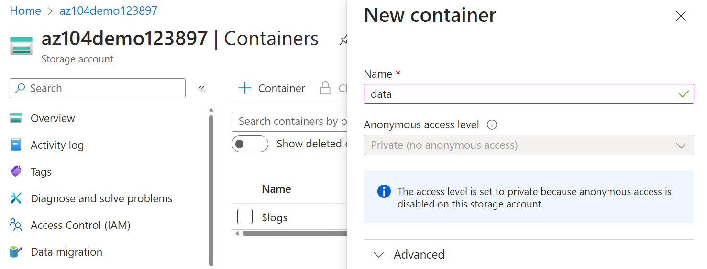
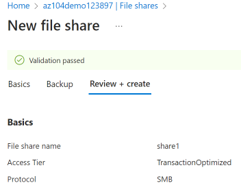

---
lab:
  title: 'Lab 07: Mengelola penyimpanan Azure'
  module: Administer Azure Storage
---

# Lab 07 - Mengelola Azure Storage

## Pengantar lab

Di lab ini, Anda belajar membuat akun penyimpanan untuk blob Azure dan file Azure. Anda belajar mengonfigurasi dan mengamankan kontainer blob. Anda juga belajar menggunakan Browser Penyimpanan untuk mengonfigurasi dan mengamankan berbagi file Azure. 

Lab ini memerlukan langganan Azure. Tipe langganan Anda dapat memengaruhi ketersediaan fitur di lab ini. Anda dapat mengubah wilayah, tetapi langkah-langkah dalam lab ini ditulis menggunakan **US Timur**.

## Perkiraan waktu: 50 menit

## Skenario lab

Organisasi Anda saat ini menyimpan data di penyimpanan data lokal. Sebagian besar file ini tidak sering diakses. Anda ingin meminimalkan biaya penyimpanan dengan menempatkan file yang jarang diakses di tingkat penyimpanan dengan harga lebih rendah. Selain itu, rencanakan untuk menjelajahi berbagai mekanisme perlindungan yang ditawarkan Azure Storage, termasuk akses jaringan, autentikasi, otorisasi, dan replikasi. Terakhir, Anda ingin menentukan sejauh mana Azure Files cocok untuk menghosting berbagi file lokal Anda.

## Diagram arsitektur

## Keterampilan pekerjaan

+ Tugas 1: Membuat dan mengonfigurasi akun penyimpanan. 
+ Tugas 2: Membuat dan mengonfigurasi penyimpanan blob aman.
+ Tugas 3: Membuat dan mengonfigurasi penyimpanan file Azure yang aman.

## Tugas 1: Membuat dan mengonfigurasi akun penyimpanan. 

Dalam tugas ini, Anda akan membuat dan mengonfigurasi akun penyimpanan. Akun penyimpanan akan menggunakan penyimpanan geo-redundan dan tidak akan memiliki akses publik. 

1. Masuk ke **portal Azure** - `https://portal.azure.com`.

1. Cari dan pilih `Storage accounts`, lalu klik **+ Buat**.

1. Pada tab **Dasar** pada bilah **Buat akun penyimpanan**, tentukan pengaturan berikut (biarkan yang lain dengan nilai defaultnya):

    | Pengaturan | Nilai |
    | --- | --- |
    | Langganan          | nama langganan Azure Anda  |
    | Grup sumber daya        | **az104-rg7** (buat baru) |
    | Nama akun penyimpanan  | nama unik global apa pun yang panjangnya antara 3 dan 24 yang terdiri atas huruf dan angka |
    | Wilayah                | **(AS) AS Timur**  |
    | Performa           | **Standar** (perhatikan opsi Premium) |
    | Redundansi geografis            | **Penyimpanan geo-redundan** (perhatikan opsi lainnya)|
    | Membuat akses baca ke data jika terjadi ketersediaan regional | Centang kotak |

    >**Tahukah Anda?** Anda harus menggunakan tingkat performa Standar untuk sebagian besar aplikasi. Gunakan tingkat performa Premium untuk aplikasi perusahaan atau berkinerja tinggi. 

1. Pada tab **Tingkat Lanjut**, gunakan ikon informasi untuk mempelajari selengkapnya tentang pilihan tersebut. Biarkan default. 

1. Pada tab **Jaringan** , di bagian **Akses** jaringan publik, pilih **Nonaktifkan**. Ini akan membatasi akses masuk sambil mengizinkan akses keluar. 

1. Tinjau tab **Perlindungan data**. Pemberitahuan 7 hari adalah kebijakan penyimpanan penghapusan sementara default. Perhatikan bahwa Anda dapat mengaktifkan penerapan versi untuk blob. Terima default.

1. Tinjau tab **Enkripsi**. Perhatikan opsi keamanan tambahan. Terima default.

1. Pilih **Tinjau + Buat**, tunggu hingga proses validasi selesai, lalu klik **Buat**.

1. Setelah akun penyimpanan disebarkan, pilih **Buka sumber daya**.

1. Tinjau bilah **Gambaran Umum** dan konfigurasi tambahan yang dapat diubah. Ini adalah pengaturan global untuk akun penyimpanan. Perhatikan bahwa akun penyimpanan dapat digunakan untuk kontainer Blob, Berbagi file, Antrean, dan Tabel.

1. Di bilah **Keamanan + jaringan** , pilih **Jaringan**. Perhatikan Akses **** jaringan publik dinonaktifkan.

    + Pilih **Kelola** dan ubah **Pengaturan akses** jaringan publik menjadi **Diaktifkan**. 
    + **Ubah cakupan** akses jaringan publik menjadi **Aktifkan dari jaringan** yang dipilih.
    + Di bagian **Alamat** IPv4, pilih **Tambahkan alamat** IPv4 klien Anda.
    + Simpan perubahan Anda.
  
1. Di bilah **Manajemen data** , pilih **Redundansi**. Perhatikan informasi tentang lokasi pusat data primer dan sekunder Anda.

1. Di bilah **Manajemen data** , pilih **Manajemen** siklus hidup, lalu pilih **Tambahkan aturan**.

    + **Beri nama** aturan `Movetocool`. Perhatikan opsi Anda untuk membatasi cakupan aturan. Klik **Berikutnya**. 
    
    + Pada halaman **Tambahkan aturan** , *jika* blob dasar terakhir dimodifikasi lebih dari `30` hari yang lalu *, pindahkan* **ke penyimpanan** dingin. Perhatikan pilihan Anda yang lain. 
    
    + Perhatikan bahwa Anda dapat mengonfigurasi kondisi lain. Pilih **Tambahkan** saat Anda selesai menjelajahi.

    

## Tugas 2: Membuat dan mengonfigurasi penyimpanan blob aman

Dalam tugas ini, Anda akan membuat kontainer blob dan mengunggah blob ke dalamnya. Kontainer blob adalah struktur seperti direktori yang menyimpan data yang tidak terstruktur.

### Membuat kontainer blob dan kebijakan penyimpanan berbasis waktu

1. Lanjutkan di portal Microsoft Azure, bekerja dengan akun penyimpanan Anda.

1. Di bilah **Penyimpanan** data, pilih **Kontainer**. 

1. Klik **+ Tambahkan kontainer** dan **Buat** kontainer dengan pengaturan berikut:

    | Pengaturan | Nilai |
    | --- | --- |
    | Nama | `data`  |
    | Tingkat akses publik | Perhatikan tingkat akses diatur ke privat |

    

1. Pada kontainer Anda, gulir ke elipsis (...) di ujung kanan, pilih **Kebijakan Akses**.

1. Di area **Penyimpanan blob yang tidak dapat diubah**, pilih **Tambahkan kebijakan**.

    | Pengaturan | Nilai |
    | --- | --- |
    | Jenis kebijakan | **Retensi berbasis waktu**  |
    | Tetapkan periode retensi untuk | `180` hari |

1. Pilih **Simpan**.

### Mengelola unggahan blob

1. Kembali ke halaman kontainer, pilih kontainer **data** Anda lalu klik **Unggah**.

1. Pada bilah **Unggah blob**, perluas bagian **Tingkat Lanjut**.

    >**Catatan**: Temukan file untuk diunggah. Ini bisa berupa semua jenis file, tetapi file kecil adalah yang terbaik. File sampel dapat diunduh dari direktori AllFiles. 

    | Pengaturan | Nilai |
    | --- | --- |
    | Telusuri file | tambahkan file yang telah Anda pilih untuk diunggah |
    | Pilih **Tingkat Lanjut** | |
    | Jenis blob | **Blob blok** |
    | Ukuran blok | **4 MiB** |
    | Tingkat penyimpanan | **Panas**  (perhatikan opsi lainnya) |
    | Unggah ke folder | `securitytest` |
    | Cakupan enkripsi | Gunakan lingkup kontainer default yang ada |

1. Klik **Unggah**.

1. Konfirmasikan bahwa Anda memiliki folder baru, dan file Anda telah diunggah. 

1. Pilih file unggahan Anda dan tinjau opsi elipsis (...) termasuk Unduh, Hapus **, **** Ubah tingkat**, dan **Dapatkan sewa**.****

1. Salin URL** file **(Pengaturan --> bilah Properti) dan tempelkan ke jendela penjelajahan Inprivate** baru**.

1. Anda akan diberikan pesan berformat XML yang menyatakan **ResourceNotFound** atau **PublicAccessNotPermitted**.

    > **Catatan**: Ini diharapkan, karena kontainer yang Anda buat memiliki tingkat akses publik yang diatur ke **Privat (tanpa akses anonim)**.

### Mengonfigurasi akses terbatas ke penyimpanan blob

1. Telusuri kembali ke file yang Anda unggah dan pilih elipsis (...) ke ujung kanan, lalu pilih **Buat SAS** dan tentukan pengaturan berikut (biarkan yang lain dengan nilai defaultnya):

    | Pengaturan | Nilai |
    | --- | --- |
    | Kunci penandatanganan | **Kunci 1** |
    | Izin | **Baca** (perhatikan pilihan Anda yang lain) |
    | Tanggal mulai | tanggal kemarin |
    | Waktu mulai | waktu saat ini |
    | Tanggal kedaluwarsa | tanggal besok |
    | Waktu kedaluwarsa | waktu saat ini |
    | Alamat IP yang diizinkan | biarkan kosong |

1. Klik **Hasilkan token SAS dan URL**.

1. Salin entri **URL SAS Blob** ke clipboard.

1. Buka jendela browser InPrivate lain dan navigasikan ke URL SAS Blob yang Anda salin di langkah sebelumnya.

    >**Catatan**: Anda seharusnya dapat melihat konten file. 

## Tugas 3: Membuat dan mengonfigurasi penyimpanan Azure File

Dalam tugas ini, Anda akan membuat dan mengonfigurasi berbagai Azure File. Anda akan menggunakan Browser Penyimpanan untuk mengelola berbagi file. 

### Membuat berbagi file dan mengunggah file

1. Di portal Azure, navigasikan kembali ke akun penyimpanan Anda, di bilah **Penyimpanan** data, klik **Berbagi file**.

1. Klik **+ Berbagi file** dan pada tab **Dasar** memberi nama berbagi file, `share1`. 

1. Perhatikan opsi **Tingkat penyimpanan**. Tetap **Transaksi dioptimalkan** default.
   
1. Pindah ke tab **Cadangan** dan pastikan **Aktifkan cadangan** **tidak** dicentang. Kami menonaktifkan pencadangan untuk menyederhanakan konfigurasi lab.

1. Klik **Tinjau + buat**, lalu **Buat**. Tunggu hingga berbagi file disebarkan.

    

### Menjelajahi Browser Penyimpanan dan mengunggah file

1. Kembali ke akun penyimpanan Anda dan pilih **Browser penyimpanan**. Browser Azure Storage adalah alat portal yang memungkinkan Anda dengan cepat melihat semua layanan penyimpanan di bawah akun Anda.

1. Pilih **Berbagi file ** dan verifikasi bahwa direktori **share1** Anda ada.

1. Pilih direktori **share1** Anda dan perhatikan bahwa Anda dapat **+ Tambahkan direktori**. Ini memungkinkan Anda membuat struktur folder.

1. Pilih **Unggah**. Telusuri ke file pilihan Anda, lalu klik **Unggah**.

    >**Catatan**: Anda dapat melihat berbagi file dan mengelola berbagi tersebut di Browser Penyimpanan. Saat ini tidak ada batasan.

### Membatasi akses jaringan ke akun penyimpanan

1. Di portal, cari dan pilih `Virtual networks`.

1. Pilih **+ Buat.** Pilih grup sumber daya Anda. dan beri **nama** pada jaringan virtual tersebut, `vnet1`.

1. Ambil default untuk parameter lain, pilih **Tinjau + buat**, lalu **Buat**.

1. Tunggu hingga jaringan virtual disebarkan, lalu pilih **Buka sumber daya**.

1. Di bagian **Pengaturan**, pilih bilah **Titik akhir layanan**.
    + Pilih **Tambahkan**. 
    + Di menu drop-down **Layanan**, pilih **Microsoft.Storage**.
    + Di menu drop-down **Subnet**, periksa subnet **Default**.
    + Klik **Tambahkan** untuk menyimpan perubahan Anda.  

1. Kembali ke akun penyimpanan Anda.

1. Di bilah **Keamanan + jaringan** , pilih **Jaringan**.

1. Di bawah **Akses** jaringan publik pilih **Kelola**. 

1. Pilih **Tambahkan jaringan** virtual lalu **Tambahkan jaringan** yang sudah ada.

1. Pilih **vnet1** dan **subnet default** , pilih **Tambahkan**.

1. Di bagian **Alamat** IPv4, **Hapus** alamat IP komputer Anda. Lalu lintas yang diizinkan hanya boleh berasal dari jaringan virtual. 

1. Pastikan untuk **Menyimpan** perubahan Anda.

    >**Catatan:** Akun penyimpanan sekarang hanya boleh diakses dari jaringan virtual yang baru saja Anda buat. 

1. Pilih **Browser penyimpanan** dan **Refresh** halaman. Navigasikan ke berbagi file atau konten blob Anda.  

    >**Catatan:** Anda harus menerima pesan *yang tidak berwenang untuk melakukan operasi ini*. Anda tidak tersambung dari jaringan virtual. Mungkin perlu waktu beberapa menit agar ini berlaku. Anda mungkin masih dapat melihat berbagi file, tetapi bukan file atau blob di akun penyimpanan. 

## Membersihkan sumber daya Anda

Jika Anda bekerja dengan **langganan Anda sendiri** luangkan waktu sebentar untuk menghapus sumber daya lab. Hal ini akan memastikan sumber daya dikosongkan dan biaya diminimalkan. Cara termudah untuk menghapus sumber daya lab adalah dengan menghapus grup sumber daya lab. 

+ Di portal Microsoft Azure, pilih grup sumber daya, pilih **Hapus grup sumber daya**, **Masukkan nama grup sumber daya**, lalu klik **Hapus**.
+ Menggunakan Azure PowerShell, `Remove-AzResourceGroup -Name resourceGroupName`.
+ Menggunakan CLI, `az group delete --name resourceGroupName`.

## Perluas pemelajaran Anda dengan Copilot
Copilot dapat membantu Anda mempelajari cara menggunakan alat pembuatan skrip Azure. Copilot juga dapat membantu di area yang tidak tercakup dalam lab atau ketika Anda memerlukan informasi lebih lanjut. Buka browser Edge dan pilih Copilot (kanan atas) atau navigasi *copilot.microsoft.com*. Luangkan beberapa menit untuk mencoba perintah ini.

+ Berikan skrip Azure PowerShell untuk membuat akun penyimpanan dengan kontainer blob. 
+ Berikan daftar periksa yang dapat saya gunakan untuk memastikan akun penyimpanan Azure saya aman.
+ Buat tabel untuk membandingkan model redundansi penyimpanan Azure.

## Pelajari lebih lanjut dengan pelatihan mandiri

+ [Buat akun](https://learn.microsoft.com/training/modules/create-azure-storage-account/) Azure Storage. Buat akun Azure Storage dengan opsi yang benar untuk kebutuhan bisnis Anda.
+ [Mengelola siklus](https://learn.microsoft.com/training/modules/manage-azure-blob-storage-lifecycle) hidup penyimpanan Azure Blob. Mempelajari cara mengelola ketersediaan data di seluruh siklus hidup penyimpanan Azure Blob.

## Poin penting

Selamat atas penyelesaian lab ini. Berikut adalah kesimpulan utama dari lab ini. 

+ Akun penyimpanan Azure berisi semua objek data Azure Storage Anda: blob, file, antrean, dan tabel. Akun penyimpanan menyediakan ruang nama unik untuk data Microsoft Azure Storage Anda yang dapat diakses dari mana saja di seluruh dunia melalui HTTP atau HTTPS.
+ Penyimpanan Azure menyediakan beberapa model redundansi termasuk Penyimpanan redundan lokal (LRS), Penyimpanan redundan zona (ZRS), dan Penyimpanan geo-redundan (GRS). 
+ Penyimpanan blob Azure memungkinkan Anda menyimpan sejumlah besar data yang tidak terstruktur di platform penyimpanan data Microsoft. Blob adalah singkatan dari Binary Large Object, yang mencakup objek seperti gambar dan file multimedia.
+ Azure file Storage menyediakan penyimpanan bersama untuk data terstruktur. Data dapat diatur dalam folder.
+ Penyimpanan yang tidak dapat diubah memberikan kemampuan untuk menyimpan data dalam status tulis sekali, membaca banyak status (WORM). Kebijakan penyimpanan yang tidak dapat diubah dapat didasarkan pada waktu atau bersifat penahanan legal.
