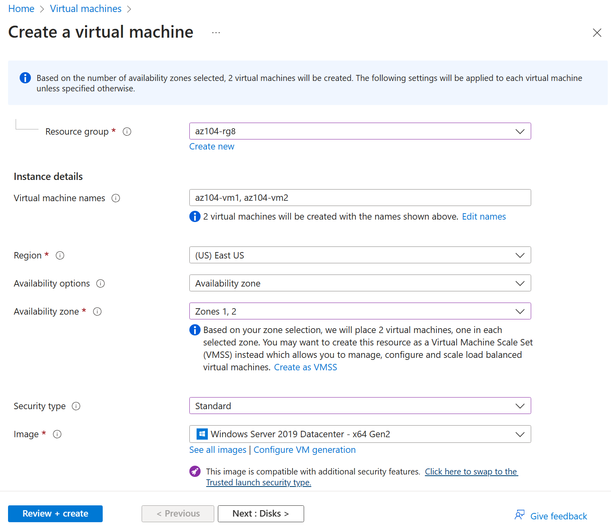

---
lab:
  title: 'Lab 08: Mengelola Virtual Machines'
  module: Administer Virtual Machines
---

# Lab 08 - Kelola Virtual Machines

## Pengenalan lab

Di lab ini, Anda membuat dan membandingkan mesin virtual dengan set skala mesin virtual. Anda mempelajari cara membuat, mengonfigurasi, dan mengubah ukuran satu mesin virtual. Anda mempelajari cara membuat kumpulan skala mesin virtual dan mengonfigurasi penskalaan otomatis.

Lab ini memerlukan langganan Azure. Tipe langganan Anda dapat memengaruhi ketersediaan fitur di lab ini. Anda dapat mengubah wilayah, tetapi langkah-langkah dalam lab ini ditulis menggunakan **US Timur**.

## Perkiraan waktu: 50 menit

## Skenario lab

Organisasi Anda ingin menjelajahi penyebaran dan konfigurasi mesin virtual Azure. Pertama, Anda mengimplementasikan mesin virtual Azure dengan penskalaan manual. Selanjutnya, Anda menerapkan Virtual Machine Scale Set dan menjelajahi penskalaan otomatis.

## Simulasi lab interaktif

Ada simulasi lab interaktif yang mungkin berguna bagi Anda untuk topik ini. Simulasi ini memungkinkan Anda mengklik skenario serupa dengan kecepatan Anda sendiri. Ada perbedaan antara simulasi interaktif dan lab ini, tetapi banyak konsep intinya sama. Langganan Azure tidak diperlukan.

+ [Membuat mesin virtual di portal](https://mslearn.cloudguides.com/en-us/guides/AZ-900%20Exam%20Guide%20-%20Azure%20Fundamentals%20Exercise%201). Membuat mesin virtual, menyambungkan dan menginstal peran server web.

+ [Menyebarkan mesin virtual dengan templat](https://mslearn.cloudguides.com/en-us/guides/AZ-900%20Exam%20Guide%20-%20Azure%20Fundamentals%20Exercise%209). Menjelajahi galeri QuickStart dan temukan templat mesin virtual. Menyebarkan templat dan memverifikasi penyebarannya.

+ [Buat mesin virtual dengan PowerShell.](https://mslearn.cloudguides.com/en-us/guides/AZ-900%20Exam%20Guide%20-%20Azure%20Fundamentals%20Exercise%2010) Gunakan Azure PowerShell untuk menyebarkan mesin virtual. Tinjau rekomendasi Azure Advisor.

+ [Buat mesin virtual dengan CLI](https://mslearn.cloudguides.com/en-us/guides/AZ-900%20Exam%20Guide%20-%20Azure%20Fundamentals%20Exercise%2011). Gunakan CLI untuk menyebarkan mesin virtual. Tinjau rekomendasi Azure Advisor.

## Keterampilan pekerjaan

+ Tugas 1: Sebarkan mesin virtual Azure yang tangguh zona dengan menggunakan portal Microsoft Azure.
+ Tugas 2: Kelola penskalaan komputasi dan penyimpanan untuk mesin virtual.
+ Tugas 3: Membuat dan mengonfigurasi Azure Virtual Machine Scale Sets.
+ Tugas 4: Menskalakan Microsoft Azure Virtual Machine Scale Sets
+ Tugas 5: Buat mesin virtual menggunakan Azure PowerShell (opsional 1).
+ Tugas 6: Buat mesin virtual menggunakan CLI (opsional 2).

## Diagram Arsitektur Azure Virtual Machines


## Tugas 1: Menyebarkan mesin virtual Azure yang tangguh zona dengan menggunakan portal Microsoft Azure

Dalam tugas ini, Anda akan menyebarkan dua mesin virtual Azure ke zona ketersediaan yang berbeda dengan menggunakan portal Microsoft Azure. Zona ketersediaan menawarkan tingkat waktu aktif tertinggi SLA untuk mesin virtual pada 99,99%. Untuk mencapai SLA ini, Anda harus menyebarkan setidaknya dua mesin virtual di berbagai zona ketersediaan.

1. Masuk ke portal Microsoft Azure - `https://portal.azure.com`.

1. Cari dan pilih `Virtual machines`, pada bilah **Mesin virtual**, klik **+ Buat**, lalu pilih di menu drop-down **mesin virtual Azure**. Perhatikan pilihan Anda yang lain.

1. Pada tab **Dasar**, di menu drop down **Zona ketersediaan**, beri tanda centang di samping **Zona 2**. Ini harus memilih **Zona 1** dan **Zona 2**.

    >**Catatan**: Ini akan menyebarkan dua mesin virtual di wilayah yang dipilih, satu di setiap zona. Anda mencapai SLA waktu aktif 99,99% karena Anda memiliki setidaknya dua VM yang didistribusikan di setidaknya dua zona. Dalam skenario di mana Anda mungkin hanya memerlukan satu VM, ini adalah praktik terbaik untuk masih menyebarkan VM ke zona lain.

1. Pada tab Dasar, lanjutkan menyelesaikan konfigurasi:

    | Pengaturan | Nilai |
    | --- | --- |
    | Langganan | nama langganan Azure Anda |
    | Grup sumber daya |  **az104-rg8** (Jika perlu, klik **Buka baru**) |
    | Nama mesin virtual | `az104-vm1` dan `az104-vm2` (Setelah memilih kedua zona ketersediaan, pilih **Edit nama** di bawah bidang nama VM.) |
    | Wilayah | **US Timur** |
    | Opsi ketersediaan | **Zona ketersediaan** |
    | Zona ketersediaan | **Zona 1, 2** (baca catatan tentang menggunakan set skala mesin virtual) |
    | Jenis keamanan | **Standard**
           |
    | Gambar | **Pusat Data Windows Server 2019 -x64 Gen2** |
    | Instans Azure Spot | **yang tidak dicentang** |
    | Ukuran | **Standar D2s v3** |
    | Nama Pengguna | `localadmin` |
    | Kata sandi | **Berikan kata sandi yang aman** |
    | Port masuk publik | **Tidak** |
    | Apakah Anda ingin menggunakan lisensi Windows Server yang sudah ada? | **Tidak Dicentang** |

    

1. Klik **Berikutnya : Disk >**, tentukan pengaturan berikut (biarkan yang lain dengan nilai defaultnya):

    | Pengaturan | Nilai |
    | --- | --- |
    | Jenis disk OS | **SSD Premium** |
    | Hapus dengan VM | **diperiksa** (default) |
    | Mengaktifkan kompatibilitas Ultra Disk | **Tidak Dicentang** |

1. Klik **Berikutnya : Jaringan >** mengambil default tetapi tidak menyediakan load balancer.

    | Pengaturan | Nilai |
    | --- | --- |
    | Menghapus IP publik dan NIC saat VM dihapus | **Dicentang** |
    | Opsi penyeimbangan muatan | **Tidak** |


1. Klik **Berikutnya : Manajemen >** dan tentukan pengaturan berikut (biarkan orang lain dengan nilai defaultnya):

    | Pengaturan | Nilai |
    | --- | --- |
    | Opsi orkestrasi patch | **yang diorkestrasi Azure** |  

1. Klik **Berikutnya : Memantau >** dan menentukan pengaturan berikut (biarkan orang lain dengan nilai defaultnya):

    | Pengaturan | Nilai |
    | --- | --- |
    | Diagnostik boot | **Nonaktifkan** |

1. Klik **Berikutnya : Tingkat lanjut >**, ambil default, lalu klik **Tinjau + Buat**.

1. Setelah validasi, klik **Buat**.

    >**Catatan:** Perhatikan bahwa mesin virtual menyebarkan NIC, disk, dan alamat IP publik (jika dikonfigurasi) dibuat secara independen dan sumber daya terkelola.

1. Tunggu hingga penyebaran selesai, lalu pilih **Buka sumber daya**.

   >**Catatan:** Pantau pesan **Pemberitahuan**

## Tugas 2: Kelola penskalaan komputasi dan penyimpanan untuk mesin virtual

Dalam tugas ini, Anda akan menskalakan mesin virtual dengan menyesuaikan ukurannya ke SKU yang berbeda. Azure memberikan fleksibilitas dalam pemilihan ukuran VM sehingga Anda dapat menyesuaikan VM untuk jangka waktu tertentu jika membutuhkan lebih banyak komputasi (atau kurang) dan memori yang dialokasikan. Konsep ini diperluas ke disk, di mana Anda dapat memodifikasi performa disk, atau meningkatkan kapasitas yang dialokasikan.

1. Pada mesin virtual **az104-vm1**, di bilah **Ketersediaan + skala**, pilih **Ukuran**.

1. Atur ukuran mesin virtual ke **DS1_v2** dan klik **Mengubah Ukuran**. Saat diminta, konfirmasi perubahan.

    >**Catatan**: Pilih ukuran lain jika **Standar DS1_v2** tidak tersedia. Mengubah ukuran juga dikenal sebagai penskalaan vertikal, naik atau turun.

    

1. Di area **Pengaturan**, pilih **Disk**.

1. Di bawah **Disk data** pilih **+ Buat dan lampirkan disk baru**. Konfigurasikan pengaturan (biarkan pengaturan lain pada nilai defaultnya).

    | Pengaturan | Nilai |
    | --- | --- |
    | Nama disk | `vm1-disk1` |
    | Jenis penyimpanan | **HDD Standar** |
    | Ukuran (GiB) | `32` |

1. Klik **Terapkan**.

1. Setelah disk dibuat, klik **Lepaskan** (jika perlu, gulir ke kanan untuk melihat ikon lepas), lalu klik **Terapkan**.

    >**Catatan**: Melepaskan menghapus disk dari VM tetapi menyimpannya di penyimpanan untuk digunakan nanti.

1. Cari dan pilih `Disks`. Dari daftar disk, pilih objek **vm1-disk1**.

    >**Catatan:** Bilah **Gambaran umum** juga menyediakan informasi performa dan penggunaan untuk disk.

1. Di bilah **Pengaturan**, pilih **Ukuran + performa**.

1. Atur jenis penyimpanan ke **SSD Standar**, lalu klik **Simpan**.

1. Navigasikan kembali ke mesin virtual **az104-vm1** dan pilih **Disk**.

1. Di bagian **Disk data**, pilih **Lampirkan disk yang ada**.

1. Di menu drop-down **Nama disk**, pilih **VM1-DISK1** 

1. Verifikasi bahwa disk sekarang **SSD Standar**.

1. Pilih **Terapkan** untuk menyimpan perubahan. 

    >**Catatan:** Anda sekarang telah membuat mesin virtual, menskalakan SKU dan ukuran disk data. Pada tugas berikutnya kami menggunakan Virtual Machine Scale Sets untuk mengotomatiskan proses penskalaan.

## Diagram Arsitektur Virtual Machine Scale Sets


## Tugas 3: Membuat dan mengonfigurasi Azure Virtual Machine Scale Sets

Dalam tugas ini, Anda akan menyebarkan set skala mesin virtual Azure di seluruh zona ketersediaan. VM Scale Sets mengurangi overhead administratif otomatisasi dengan memungkinkan Anda mengonfigurasi metrik atau kondisi yang memungkinkan set skala untuk menskalakan, menskalakan, atau memperluas skala secara horizontal.

1. Di portal Microsoft Azure, cari dan pilih `Virtual machine scale sets` dan, pada bilah**kumpulan skala Mesin virtual**, klik **+ Buat**.

1. Pada tab **Dasar** bilah **Buat kumpulan skala mesin virtual**, tentukan pengaturan berikut (biarkan opsi yang lain dengan nilai defaultnya) dan klik **Berikutnya : Spot >**:

    | Pengaturan | Nilai |
    | --- | --- |
    | Langganan | nama langganan Azure Anda  |
    | Grup sumber daya | **az104-rg8**  |
    | Nama set skala komputer virtual | `vmss1` |
    | Wilayah | **(AS) AS Timur** |
    | Zona ketersediaan | **Zona 1, 2, 3** |
    | Mode Orkestrasi | **Seragam** |
    | Jenis keamanan | **Standard**
           |
    | Gambar | **Pusat Data Windows Server 2019 -x64 Gen2** |
    | Jalankan dengan diskon Azure Spot | **Tidak Dicentang** |
    | Ukuran | **D2s_v3 standar** |
    | Nama Pengguna | `localadmin` |
    | Kata sandi | **Berikan kata sandi yang aman**  |
    | Sudah memiliki lisensi Windows Server? | **Tidak Dicentang** |

    >**Catatan**: Untuk daftar wilayah Azure yang mendukung penyebaran mesin virtual Windows ke zona ketersediaan, baca [Apa itu Zona Ketersediaan di Azure?](https://docs.microsoft.com/en-us/azure/availability-zones/az-overview)

    

1. Pada tab **Spot**, terima default dan pilih **Berikutnya : Disk >**.

1. Pada tab **Disk**, terima nilai default dan klik **Berikutnya : Jaringan >**.

1. Pada halaman **Jaringan**, klik tautan **Buat jaringan virtual** di bawah kotak teks **Jaringan virtual** dan buat jaringan virtual baru dengan pengaturan berikut (biarkan orang lain dengan nilai defaultnya).  Setelah selesai, pilih **OK**.

    | Pengaturan | Nilai |
    | --- | --- |
    | Nama | `vmss-vnet` |
    | Rentang alamat | `10.82.0.0/20` (ubah apa yang ada di sana) |
    | Nama subnet | `subnet0` |
    | Rentang subnet | `10.82.0.0/24` |

1. Di tab **Jaringan**, klik ikon **Edit antarmuka jaringan** di sebelah kanan entri antarmuka jaringan.

1. Untuk bagian**grup keamanan jaringan NIC**, pilih **Tingkat Lanjut ** lalu klik **Buat baru** di bawah daftar drop-down **Konfigurasikan grup keamanan jaringan**.

1. Pada bilah **Buat grup keamanan jaringan**, tentukan pengaturan berikut (biarkan opsi yang lain dengan nilai defaultnya):

    | Pengaturan | Nilai |
    | --- | --- |
    | Nama | **vmss1-nsg** |

1. Klik **Tambahkan aturan masuk** dan tambahkan aturan keamanan masuk dengan pengaturan berikut (biarkan opsi yang lain dengan nilai defaultnya):

    | Pengaturan | Nilai |
    | --- | --- |
    | Sumber | **Mana pun** |
    | Source port ranges | * |
    | Tujuan | **Mana pun** |
    | Layanan | **HTTP** |
    | Tindakan
           | **Izinkan** |
    | Prioritas | **1010** |
    | Nama | `allow-http` |

1. Klik **Tambahkan** dan, kembali pada bilah **Buat grup keamanan jaringan**, klik **OK**.

1. Di bilah **Edit antarmuka jaringan**, di bagian **Alamat IP Publik**, klik **Diaktifkan** dan klik **OKE**.

1. Di tab **Jaringan**, di bawah bagian **Penyeimbangan beban**, tentukan yang berikut ini (biarkan yang lain dengan nilai defaultnya).

    | Pengaturan | Nilai |
    | --- | --- |
    | Opsi penyeimbangan muatan | **Penyeimbang beban Azure** |
    | Pilih load balancer | **Membuat penyeimbang beban** |

1. Pada halaman **Buat penyeimbang beban**, tentukan nama load balancer dan ambil default. Klik **Buat** setelah selesai, lalu **Berikutnya : Manajemen >**.

    | Pengaturan | Nilai |
    | --- | --- |
    | Nama load balancer | `vmss-lb` |

    >**Catatan:** Jeda selama satu menit dan tinjau apa yang Anda lakukan. Pada titik ini, Anda telah mengonfigurasi set skala mesin virtual dengan disk dan jaringan. Dalam konfigurasi jaringan, Anda telah membuat grup keamanan jaringan dan mengizinkan HTTP. Anda juga telah membuat load balancer dengan alamat IP publik.

1. Pada tab **Manajemen**, tentukan pengaturan berikut (biarkan orang lain dengan nilai defaultnya):

    | Pengaturan | Nilai |
    | --- | --- |
    | Diagnostik boot | **Nonaktifkan** |

1. Klik **Berikutnya : Kesehatan >**.

1. Pada tab **Kesehatan**, tinjau pengaturan default tanpa membuat perubahan apa pun dan klik **Berikutnya : Lanjutan >**.

1. Pada tab **Tingkat Lanjut**, klik **Tinjau + buat**.

1. Pada tab **Tinjau + buat**, pastikan validasi lulus dan klik **Buat**.

    >**Catatan**: Tunggu hingga penyebaran kumpulan skala mesin virtual selesai. Ini akan memakan waktu sekitar 5 menit. Saat Anda menunggu tinjau dokumentasi [dokumentasi](https://learn.microsoft.com/azure/virtual-machine-scale-sets/overview).

## Tugas 4: Menskalakan Azure Virtual Machine Scale Sets

Dalam tugas ini, Anda menskalakan set skala mesin virtual menggunakan aturan skala kustom.

1. Pilih **Buka** sumber daya atau cari dan pilih set skala **vmss1**.

1. Pilih **Ketersediaan + Penskalan** dari menu sisi kiri, lalu pilih **Penskalakan**.

>**Tahukah Anda?** Anda dapat **Skala manual** atau **skala otomatis kustom**. Dalam set skala dengan sejumlah kecil instans VM, meningkatkan atau mengurangi jumlah instans (Skala manual) mungkin yang terbaik. Dalam set skala dengan sejumlah besar instans VM, penskalaan berdasarkan metrik (Skala otomatis kustom) mungkin lebih sesuai.

### Aturan peluasan skala

1. Pilih **Skala otomatis kustom**. Kemudian ubah **Mode skala** menjadi **Skala berdasarkan metrik**. Lalu pilih **Tambahkan aturan**.

1. Mari kita buat aturan yang secara otomatis meningkatkan jumlah instans VM. Aturan ini diskalakan ketika beban CPU rata-rata lebih besar dari 70% selama periode 10 menit. Ketika aturan memicu, jumlah instans VM bertambah sebanyak 20%.

    | Pengaturan | Nilai |
    | --- | --- |
    | Sumber metrik | **Sumber daya saat ini (vmss1)** |
    | Namespace metrik | **Host Mesin Virtual** |
    | Nama metrik | **CPU Persentase ** (tinjau pilihan Anda yang lain) |
    | Operator | **Lebih besar dari** |
    | Ambang batas metrik untuk memicu tindakan penskalaan | **70** |
    | Durasi (menit) | **10** |
    | Statistik butir waktu | **Tengah** |
    | Operasi | **Tingkatkan persen berdasarkan** (tinjau pilihan lain) |
    | Pendinginan (menit) | **5**
           |
    | Persentase | **20** |

    

1. Pastikan untuk **Menyimpan** perubahan Anda.

### Menskalakan dalam aturan

1. Selama malam atau akhir pekan, permintaan dapat menurun sehingga penting untuk membuat aturan skala.

1. Mari kita buat aturan yang mengurangi jumlah instans VM dalam set skala. Jumlah instans harus berkurang ketika beban CPU rata-rata turun di bawah 30% selama periode 10 menit. Ketika aturan memicu, jumlah instans VM berkurang sebanyak 20%.

1. Pilih **Tambahkan aturan**, sesuaikan pengaturan, lalu pilih **Tambahkan**.

    | Pengaturan | Nilai |
    | --- | --- |
    | Operator | **Kurang dari** |
    | Ambang | **30** |
    | Operasi | **mengurangi persentase berdasarkan** (tinjau pilihan Anda yang lain) |
    | Persentase | **20** |

1. Pastikan untuk **Menyimpan** perubahan Anda.

### Mengatur batas instans

1. Saat aturan skala otomatis Anda diterapkan, batas instans memastikan bahwa Anda tidak meluaskan skala di luar jumlah maksimum instans atau menskalakan di luar jumlah instans minimum.

1. **Batas instans** ditampilkan di halaman **Penskalan** setelah aturan.

    | Pengaturan | Nilai |
    | --- | --- |
    | Minimum | **2** |
    | Maksimum | **10** |
    | Default | **2** |

1. Pastikan untuk **Simpan** perubahan Anda

1. Pada halaman **vmss1**, pilih **instans **. Di sinilah Anda akan memantau jumlah instans mesin virtual.

    >**Catatan:** Jika Anda tertarik menggunakan Azure PowerShell untuk pembuatan mesin virtual, coba Tugas 5. Jika Anda tertarik menggunakan CLI untuk membuat mesin virtual, coba Tugas 6.

## Tugas 5: Membuat mesin virtual menggunakan Azure PowerShell (opsi 1)

1. Gunakan ikon (kanan atas) untuk meluncurkan sesi **Cloud Shell**. Secara bergantian, navigasikan langsung ke `https://shell.azure.com`.

1. Pastikan untuk memilih **PowerShell**. Jika perlu, konfigurasikan penyimpanan shell.

1. Jalankan perintah berikut untuk membuat mesin virtual. Saat diminta, berikan nama pengguna dan kata sandi untuk VM. Saat Anda menunggu, lihat referensi perintah [New-AzVM](https://learn.microsoft.com/powershell/module/az.compute/new-azvm?view=azps-11.1.0) untuk semua parameter yang terkait dengan pembuatan mesin virtual.

    ```powershell
    New-AzVm `
    -ResourceGroupName 'az104-rg8' `
    -Name 'myPSVM' `
    -Location 'East US' `
    -Image 'Win2019Datacenter' `
    -Zone '1' `
    -Size 'Standard_D2s_v3' `
    -Credential (Get-Credential)
    ```

1. Setelah perintah selesai, gunakan **Get-AzVM** untuk mencantumkan mesin virtual di grup sumber daya Anda.

    ```powershell
    Get-AzVM `
    -ResourceGroupName 'az104-rg8' `
    -Status
    ```

1. Verifikasi bahwa mesin virtual baru Anda tercantum dan **Statusnya** adalah **Berjalan**.

1. Gunakan **Stop-AzVM** untuk membatalkan alokasi mesin virtual Anda. Ketik **Ya** untuk mengonfirmasi.

    ```powershell
    Stop-AzVM `
    -ResourceGroupName 'az104-rg8' `
    -Name 'myPSVM' 
    ```

1. Gunakan **Get-AzVM** dengan parameter **-Status** untuk memverifikasi bahwa komputer **dibatalkan alokasinya**.

    >**Tahukah Anda?** Saat Anda menggunakan Azure untuk menghentikan mesin virtual Anda, statusnya *dibatalkan alokasinya*. Artinya, semua IP publik non-statis akan dilepaskan, dan Anda berhenti membayar biaya komputasi VM.

## Tugas 6: Membuat mesin virtual menggunakan CLI (opsi 2)

1. Gunakan ikon (kanan atas) untuk meluncurkan sesi **Cloud Shell**. Secara bergantian, navigasikan langsung ke `https://shell.azure.com`.

1. Pastikan untuk memilih **Bash**. Jika perlu, konfigurasikan penyimpanan shell.

1. Jalankan perintah berikut untuk membuat mesin virtual. Saat diminta, berikan nama pengguna dan kata sandi untuk VM. Saat Anda menunggu, lihat referensi perintah [az vm create](https://learn.microsoft.com/cli/azure/vm?view=azure-cli-latest#az-vm-create) untuk semua parameter yang terkait dengan pembuatan mesin virtual.

    ```sh
    az vm create --name myCLIVM --resource-group az104-rg8 --image Ubuntu2204 --admin-username localadmin --generate-ssh-keys
    ```

1. Setelah perintah selesai, gunakan **az vm show** untuk memverifikasi komputer Anda dibuat.

    ```sh
    az vm show --name  myCLIVM --resource-group az104-rg8 --show-details
    ```

1. Verifikasi **powerState** adalah **VM Berjalan**.

1. Gunakan **az vm deallocate** untuk membatalkan alokasi mesin virtual Anda. Ketik **Ya** untuk mengonfirmasi.

    ```sh
    az vm deallocate --resource-group az104-rg8 --name myCLIVM
    ```

1. Gunakan **az vm show** untuk memastikan **powerState** adalah **VM yang tidak dialokasikan**.

    >**Tahukah Anda?** Saat Anda menggunakan Azure untuk menghentikan mesin virtual Anda, statusnya *dibatalkan alokasinya*. Artinya, semua IP publik non-statis akan dilepaskan, dan Anda berhenti membayar biaya komputasi VM.

## Membersihkan sumber daya Anda

Jika Anda bekerja dengan **langganan Anda sendiri** luangkan waktu sebentar untuk menghapus sumber daya lab. Hal ini akan memastikan sumber daya dikosongkan dan biaya diminimalkan. Cara termudah untuk menghapus sumber daya lab adalah dengan menghapus grup sumber daya lab. 

+ Di portal Microsoft Azure, pilih grup sumber daya, pilih **Hapus grup sumber daya**, **Masukkan nama grup sumber daya**, lalu klik **Hapus**.
+ Menggunakan Azure PowerShell, `Remove-AzResourceGroup -Name resourceGroupName`.
+ Menggunakan CLI, `az group delete --name resourceGroupName`.

## Perluas pemelajaran Anda dengan Copilot
Copilot dapat membantu Anda mempelajari cara menggunakan alat pembuatan skrip Azure. Copilot juga dapat membantu di area yang tidak tercakup dalam lab atau ketika Anda memerlukan informasi lebih lanjut. Buka browser Edge dan pilih Copilot (kanan atas) atau navigasikan ke *copilot.microsoft.com*. Luangkan beberapa menit untuk mencoba perintah ini.

+ Berikan langkah-langkah dan perintah Azure CLI untuk membuat mesin virtual Linux. 
+ Tinjau cara Anda dapat menskalakan mesin virtual dan meningkatkan performa.
+ Menjelaskan kebijakan manajemen siklus hidup penyimpanan Azure dan bagaimana mereka dapat mengoptimalkan biaya.

## Pelajari lebih lanjut dengan pelatihan mandiri

+ [Membuat mesin virtual Windows di Azure](https://learn.microsoft.com/training/modules/create-windows-virtual-machine-in-azure/). Membuat komputer virtual Windows menggunakan portal Microsoft Azure. Sambungkan ke komputer virtual Windows yang sedang berjalan menggunakan Desktop Jarak Jauh
+ [Membangun aplikasi yang dapat diskalakan dengan Virtual Machine Scale Sets](https://learn.microsoft.com/training/modules/build-app-with-scale-sets/). Aktifkan aplikasi Anda untuk secara otomatis menyesuaikan dengan perubahan beban sambil meminimalkan biaya dengan Virtual Machine Scale Sets.
+ [Sambungkan ke mesin virtual melalui portal Microsoft Azure dengan menggunakan Azure Bastion](https://learn.microsoft.com/en-us/training/modules/connect-vm-with-azure-bastion/). Sebarkan Azure Bastion untuk terhubung dengan aman ke mesin virtual Azure langsung dalam portal Microsoft Azure untuk mengganti solusi jumpbox yang ada secara efektif, memantau sesi jarak jauh dengan menggunakan log diagnostik, dan mengelola sesi jarak jauh dengan memutuskan sesi pengguna.

## Poin penting

Selamat atas penyelesaian lab ini. Berikut adalah kesimpulan utama dari lab ini.

+ Mesin virtual Azure adalah sumber daya komputasi sesuai permintaan dan dapat diskalakan.
+ Mesin virtual Azure menyediakan opsi penskalaan vertikal dan horizontal.
+ Mengonfigurasi mesin virtual Azure termasuk memilih sistem operasi, ukuran, penyimpanan, dan pengaturan jaringan.
+ Azure Virtual Machine Scale Sets memungkinkan Anda membuat dan mengelola grup VM yang di-load balanced.
+ Mesin virtual dalam Virtual Machine Scale Set dibuat dari gambar dan konfigurasi yang sama.
+ Dalam Virtual Machine Scale Set, jumlah instans VM dapat secara otomatis meningkatkan atau mengurangi respons terhadap permintaan atau jadwal yang ditentukan.
