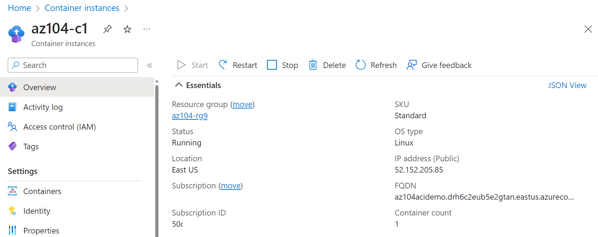

---
lab:
  title: 'Lab 09b: Menerapkan Azure Container Instances'
  module: Administer PaaS Compute Options
---

# Lab 09b - Menerapkan Azure Container Instances

## Pengenalan lab

Di lab ini, Anda mempelajari cara menerapkan dan menyebarkan Azure Container Instances.

Lab ini memerlukan langganan Azure. Jenis langganan Anda dapat memengaruhi ketersediaan fitur di lab ini. Anda dapat mengubah wilayah, tetapi langkah-langkahnya ditulis menggunakan **US** Timur.

## Perkiraan waktu: 15 menit

## Skenario lab

Organisasi Anda memiliki aplikasi web yang berjalan pada komputer virtual di pusat data lokal Anda. Organisasi ingin memindahkan semua aplikasi ke cloud tetapi tidak ingin memiliki sejumlah besar server untuk dikelola. Anda memutuskan untuk mengevaluasi Azure Container Instances dan Docker. 
## Simulasi lab interaktif

Ada simulasi lab interaktif yang mungkin berguna bagi Anda untuk topik ini. Simulasi ini memungkinkan Anda mengklik skenario serupa dengan kecepatan Anda sendiri. Ada perbedaan antara simulasi interaktif dan lab ini, tetapi banyak konsep intinya sama. Langganan Azure tidak diperlukan.

+ [Menyebarkan Azure Container Instances](https://mslearn.cloudguides.com/en-us/guides/AZ-900%20Exam%20Guide%20-%20Azure%20Fundamentals%20Exercise%203). Membuat, mengonfigurasi, dan menyebarkan kontainer Docker dengan Azure Container Instances.
  
+ [Menerapkan Azure Container Instances](https://mslabs.cloudguides.com/guides/AZ-104%20Exam%20Guide%20-%20Microsoft%20Azure%20Administrator%20Exercise%2014).  Sebarkan gambar Docker menggunakan Azure Container Instances. 

## Keterampilan pekerjaan

- Tugas 1: Sebarkan Azure Container Instance menggunakan gambar Docker.
- Tugas 2: Menguji dan memverifikasi penyebaran Azure Container Instance.

## Diagram arsitektur

## Tugas 1: Menyebarkan Azure Container Instance menggunakan gambar Docker

Dalam tugas ini, Anda akan membuat aplikasi web sederhana menggunakan gambar Docker. Docker adalah platform yang menyediakan kemampuan untuk mengemas dan menjalankan aplikasi di lingkungan terisolasi yang disebut kontainer. Azure Container Instances menyediakan lingkungan komputasi untuk gambar kontainer.

1. Masuk ke **portal Azure** - `https://portal.azure.com`.

1. Di portal Azure, cari dan pilih `Container instances` lalu, pada bilah **Instans** kontainer, klik **+ Buat**.

1. Pada tab **Dasar-dasar** pada bilah **Buat instans penampung**, tentukan pengaturan berikut (biarkan yang lain dengan nilai defaultnya):

    | Pengaturan | Nilai |
    | ---- | ---- |
    | Langganan | Pilih langganan Azure Anda |
    | Grup sumber daya | `az104-rg9` (Jika perlu, pilih **Buat baru**) |
    | Nama kontainer | `az104-c1` |
    | Wilayah | **US** Timur (atau wilayah yang tersedia di dekat Anda)|
    | Sumber Gambar | **Gambar memulai cepat** |
    | Gambar | **mcr.microsoft.com/azuredocs/aci-helloworld:latest (Linux)** |

1. Klik **Berikutnya: Jaringan >** dan tentukan pengaturan berikut (biarkan orang lain dengan nilai defaultnya):

    | Pengaturan | Nilai |
    | --- | --- |
    | Label nama DNS | nama host DNS yang valid dan unik secara global |

    >**Catatan**: Kontainer Anda akan dapat dijangkau secara publik pada dns-name-label.region.azurecontainer.io. Jika Anda menerima pesan galat **DNS name label not available**, tentukan nilai yang berbeda.

1. Klik **Berikutnya: >** Tingkat Lanjut, tinjau pengaturan tanpa membuat perubahan apa pun.

 1. Klik **Tinjau + Buat**, pastikan validasi lulus lalu pilih **Buat**.

    >**Catatan**: Tunggu hingga penyebaran selesai. Ini akan memakan waktu 2-3 menit.

    >**Catatan**: Saat menunggu, Anda mungkin tertarik untuk melihat [kode di belakang aplikasi](https://github.com/Azure-Samples/aci-helloworld) sampel. Untuk melihat kode, telusuri \\folder aplikasi.

## Tugas 2: Menguji dan memverifikasi penyebaran Azure Container Instance 

Dalam tugas ini, Anda meninjau penyebaran instans kontainer. Secara default, Azure Container Instance dapat diakses melalui port 80. Setelah instans disebarkan, Anda dapat menavigasi ke kontainer menggunakan nama DNS yang Anda berikan di tugas sebelumnya.

1. Pada bilah penyebaran, klik tautan **Buka sumber daya**.

1. Pada bilah **Ringkasan** instans penampung, verifikasi bahwa **Status** dilaporkan sebagai **Berjalan**.

1. Salin nilai instans kontainer **FQDN**, buka tab browser baru, dan navigasikan ke URL yang sesuai.

     

1. Pastikan halaman **Selamat datang di Azure Container Instance** ditampilkan. Refresh halaman beberapa kali untuk membuat beberapa entri log lalu tutup tab browser.  

1. Di bagian **Pengaturan** bilah instans kontainer, klik **Kontainer**, lalu klik **Log**.

1. Verifikasi bahwa Anda melihat entri log yang mewakili permintaan HTTP GET yang dihasilkan dengan menampilkan aplikasi di browser.
   
## Membersihkan sumber daya Anda

Jika Anda bekerja dengan **langganan** Anda sendiri membutuhkan waktu satu menit untuk menghapus sumber daya lab. Ini akan memastikan sumber daya dibebankan dan biaya diminimalkan. Cara term mudah untuk menghapus sumber daya lab adalah dengan menghapus grup sumber daya lab. 

+ Di portal Azure, pilih grup sumber daya, pilih **Hapus grup** sumber daya, **Masukkan nama** grup sumber daya, lalu klik **Hapus**.
+ Menggunakan Azure PowerShell, `Remove-AzResourceGroup -Name resourceGroupName`.
+ Menggunakan CLI, `az group delete --name resourceGroupName`.

## Poin penting

Selamat atas penyelesaian lab. Berikut adalah takeaway utama untuk lab ini. 

+ Azure Container Instances (ACI) adalah layanan yang memungkinkan Anda menyebarkan kontainer di cloud publik Microsoft Azure.
+ ACI tidak mengharuskan Anda untuk menyediakan atau mengelola infrastruktur yang mendasar.
+ ACI mendukung kontainer Linux dan kontainer Windows.
+ Beban kerja pada ACI biasanya dimulai dan dihentikan oleh beberapa jenis proses atau pemicu dan biasanya berumur pendek. 

## Pelajari lebih lanjut dengan pelatihan mandiri

+ [Jalankan gambar kontainer di Azure Container Instances](https://learn.microsoft.com/training/modules/create-run-container-images-azure-container-instances/). Pelajari cara Azure Container Instances dapat membantu Anda dalam menyebarkan kontainer dengan cepat, cara mengatur variabel lingkungan, dan menentukan kebijakan hidupkan ulang kontainer.

    
