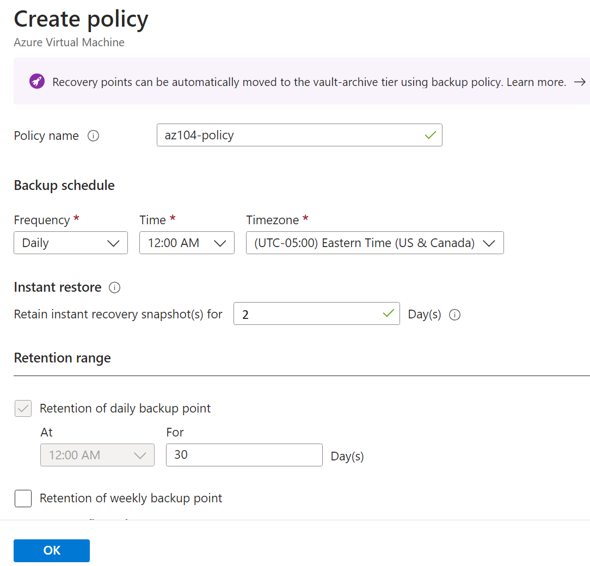

---
lab:
  title: 'Lab 10: Menerapkan Perlindungan Data'
  module: Administer Data Protection
---

# Lab 10 - Menerapkan Perlindungan Data

## Pengenalan lab    

Di lab ini, Anda mempelajari tentang pencadangan dan pemulihan mesin virtual Azure. Anda belajar membuat vault Recovery Service dan kebijakan pencadangan untuk mesin virtual Azure. Anda mempelajari tentang pemulihan bencana dengan Azure Site Recovery. 

Lab ini memerlukan langganan Azure. Tipe langganan Anda dapat memengaruhi ketersediaan fitur di lab ini. Anda dapat mengubah wilayah, tetapi langkah-langkah ditulis menggunakan **US Timur** dan **US Barat**.

## Perkiraan waktu: 50 menit

## Skenario lab

Organisasi Anda sedang mengevaluasi cara mencadangkan dan memulihkan mesin virtual Azure dari kehilangan data yang tidak disengaja atau berbahaya. Selain itu, organisasi ingin mengeksplorasi penggunaan Azure Site Recovery untuk skenario pemulihan bencana. 

## Simulasi lab interaktif

Ada simulasi lab interaktif yang mungkin berguna topik ini. Simulasi ini memungkinkan Anda mengeklik skenario serupa dengan kecepatan Anda sendiri. Ada perbedaan antara simulasi interaktif dan lab ini, tetapi banyak konsep intinya sama. Langganan Azure tidak diperlukan.

+ **[Cadangkan mesin virtual dan file lokal.](https://mslabs.cloudguides.com/guides/AZ-104%20Exam%20Guide%20-%20Microsoft%20Azure%20Administrator%20Exercise%2016)**. Buat vault layanan pemulihan dan terapkan pencadangan mesin virtual Azure. Terapkan pencadangan file dan folder lokal menggunakan agen Microsoft Azure Recovery Services. Pencadangan lokal berada di luar cakupan lab ini, tetapi mungkin berguna untuk melihat langkah-langkah tersebut. 

## Keterampilan pekerjaan

+ Tugas 1: Gunakan templat untuk menyediakan infrastruktur.
+ Tugas 2: Buat dan konfigurasikan vault Recovery Services.
+ Tugas 3: Konfigurasikan pencadangan tingkat mesin virtual Azure.
+ Tugas 4: Pantau Azure Backup.
+ Tugas 5: Aktifkan replikasi mesin virtual. 

## Perkiraan waktu: 40 menit

## Diagram arsitektur

## Tugas 1: Gunakan templat untuk menyediakan infrastruktur

Dalam tugas ini, Anda akan menggunakan templat untuk menyebarkan mesin virtual. Mesin virtual akan digunakan untuk menguji skenario pencadangan yang berbeda.

1. Unduh file lab **\\Allfiles\\Lab10\\**.

1. Masuk ke **portal Azure** - `https://portal.azure.com`.

1. Cari dan pilih `Deploy a custom template`.

1. Di halaman penyebaran kustom, pilih **Buat templat Anda sendiri di editor**.

1. Di halaman edit templat, pilih **Muat file**.

1. Temukan dan pilih file **\\Allfiles\\Lab10\\az104-10-vms-edge-template.json**, lalu pilih **Buka**.

   >**Catatan:** Luangkan waktu sejenak untuk meninjau templat. Kami menyebarkan jaringan virtual dan mesin virtual supaya dapat menunjukkan pencadangan dan pemulihan. 

1. **Simpan** perubahan Anda.

1. Pilih **Edit parameter**, lalu **Muat file**.

1. Muat dan pilih file **\\Allfiles\\Lab10\\az104-10-vms-edge-parameters.json**.

1. **Simpan** perubahan Anda.

1. Gunakan informasi berikut untuk melengkapi bidang penyebaran kustom, sehingga semua bidang lainnya tetap memiliki nilai default:

    | Pengaturan       | Nilai         | 
    | ---           | ---           |
    | Langganan  | Langganan Azure Anda |
    | Grup sumber daya| `az104-rg-region1` (Jika perlu, pilih **Buat baru**)
    | Wilayah        | **US Timur**   |
    | Nama Pengguna      | **localadmin**   |
    | Kata sandi      | Berikan kata sandi yang kompleks |

1. Pilih **Tinjau + Buat**, kemudian pilih **Buat**.

    >**Catatan:** Tunggu hingga templat disebarkan, lalu pilih **Buka sumber daya**. Anda harus memiliki satu mesin virtual dalam satu jaringan virtual. 

## Tugas 2: Buat dan konfigurasikan vault Recovery Services

Dalam tugas ini, Anda akan membuat vault Recovery Services. Vault Recovery Services menyediakan penyimpanan untuk data mesin virtual. 

1. Di portal Microsoft Azure, cari dan pilih `Recovery Services vaults` dan, pada bilah **vault Recovery Services**, klik **+ Buat**.

1. Pada bilah **Buat Recovery Services vault**, tentukan pengaturan berikut:

    | Pengaturan | Nilai |
    | --- | --- |
    | Langganan | nama langganan Azure Anda |
    | Grup sumber daya | `az104-rg-region1`  |
    | Nama Vault | `az104-rsv-region1` |
    | Wilayah | **US Timur** |

    >**Catatan**: Pastikan Anda menentukan wilayah yang sama tempat Anda menyebarkan mesin virtual di tugas sebelumnya.

    

1. Klik **Tinjau + Buat**, pastikan validasi lulus, lalu klik **Buat**.

    >**Catatan**: Tunggu hingga penyebaran selesai. Penyebaran akan memakan waktu beberapa menit. 

1. Saat penyebaran selesai, klik **Buka Sumber Daya**.

1. Di bagian **Pengaturan** , klik **Properti**.

1. Pilih tautan **Perbarui** di bagian label **Konfigurasi Pencadangan**.

1. Pada bilah **Konfigurasi Cadangan**, tinjau pilihan **Jenis replikasi penyimpanan**. Biarkan pengaturan default **Geo-redundant** di tempatnya dan tutup bilah.

    >**Catatan**: Pengaturan ini hanya dapat dikonfigurasi jika tidak ada item cadangan yang ada.
    
    >**Tahukah Anda?** Opsi Pemulihan Lintas Wilayah memungkinkan Anda memulihkan data di [wilayah berpasangan Azure sekunder](https://learn.microsoft.com/azure/backup/backup-create-recovery-services-vault#set-cross-region-restore). 

1. **Pilih tautan Perbarui** di bawah **Pengaturan Keamanan > Penghapusan Sementara dan label pengaturan** keamanan.

1. Pada bilah **Pengaturan Keamanan**, perhatikan bahwa **Penghapusan Sementara (Untuk beban kerja yang berjalan di Azure)** **Diaktifkan**. Perhatikan bahwa **periode retensi penghapusan sementara** adalah **14** hari. 

>**Tahukah Anda?** Azure memiliki dua jenis vault: Vault Recovery Services dan vault Cadangan. Perbedaan utamanya adalah sumber data yang dapat dicadangkan. Pelajari selengkapnya tentang [perbedaannya](https://learn.microsoft.com/answers/questions/405915/what-is-difference-between-recovery-services-vault).

## Tugas 3: Konfigurasikan pencadangan tingkat mesin virtual Azure

Dalam tugas ini, Anda akan menerapkan pencadangan tingkat mesin virtual Azure. Sebagai bagian dari cadangan VM, Anda harus menentukan kebijakan penyimpanan dan pencadangan yang berlaku untuk pencadangan tersebut. VM yang berbeda dapat memiliki kebijakan pencadangan dan retensi yang berbeda yang ditetapkan padanya.

   >**Catatan**: Sebelum Anda memulai tugas ini, pastikan penyebaran yang Anda mulai di tugas pertama lab ini telah berhasil diselesaikan.

1. Pada bilah vault Recovery Services, klik **Ringkasan**, lalu klik **+ Cadangan**.

1. Pada bilah **Sasaran Pencadangan**, tentukan pengaturan berikut:

    | Pengaturan | Nilai |
    | --- | --- |
    | Di mana beban kerja Anda berjalan? | **Azure** (perhatikan opsi Anda yang lain) |
    | Apa yang ingin Anda cadangkan? | **Mesin virtual** (perhatikan opsi Anda yang lain |

1. Pilih **Backup**.

1. Perhatikan ada dua **Jenis Sub-kebijakan**: **Ditingkatkan** dan **Standar**. Tinjau pilihan, lalu pilih **Standar**. 

1. Di **Kebijakan pencadangan**, pilih **Buat kebijakan baru**.

1. Tetapkan kebijakan pencadangan baru dengan pengaturan berikut (biarkan opsi yang lain dengan nilai defaultnya):

    | Pengaturan | Nilai |
    | ---- | ---- |
    | Nama Azure Policy | `az104-backup` |
    | Frekuensi
           | **Harian** |
    | Waktu | **12:00 Siang** |
    | Timezone | nama zona waktu lokal Anda |
    | Pertahankan snapshot pemulihan instans untuk | **2** Hari |

    

1. Klik **OK** untuk membuat kebijakan lalu, di bagian **Komputer Virtual** , pilih **Tambahkan** (gulir ke bawah).

1. Pada bilah **Pilih mesin virtual**, pilih **az-104-10-vm0**, klik **OK**, lalu kembali ke bilah **Cadangan**, klik **Aktifkan pencadangan**.

    >**Catatan**: Tunggu hingga cadangan diaktifkan. Proses ini akan memakan waktu sekitar 2 menit.

1. Setelah penyebaran, pilih **Buka sumber daya**.
   
1. Di bagian **Item terproteksi**, klik **Item cadangan**, lalu klik entri **mesin virtual Azure**.

1. Pilih tautan **Lihat detail** untuk **az104-10-vm0**, dan tinjau nilai entri **Pra-Pemeriksaan Cadangan** dan **Status Cadangan Terakhir**.

    >**Catatan:** Perhatikan bahwa pencadangan tertunda.
    
1. Pilih **Cadangkan sekarang**, terima nilai default di daftar drop-down **Pertahankan Cadangan Hingga**, lalu klik **OK**.

    >**Catatan**: Jangan menunggu hingga pencadangan selesai, tetapi lanjutkan ke tugas berikutnya.

## Tugas 4: Pantau Azure Backup

Di tugas ini, Anda akan menyebarkan akun penyimpanan Azure. Kemudian, Anda akan mengonfigurasi vault untuk mengirim log dan metrik ke akun penyimpanan. Repositori ini kemudian dapat digunakan dengan Analitik Log atau solusi pemantauan pihak ketiga lainnya.

1. Dari portal Azure, telusuri dan pilih `Storage accounts`.

1. Pada halaman Akun penyimpanan, pilih **Buat**.

1. Gunakan informasi berikut untuk menentukan akun penyimpanan, lalu pilih **Tinjau + buat**.

    | Pengaturan | Nilai |
    | --- | --- | 
    | Langganan          | *Langganan Anda*    |
    | Grup sumber daya        | **az104-rg-region1**        |
    | Nama akun penyimpanan  | Berikan nama yang unik secara global   |
    | Wilayah                | **US Timur**   |

1. Pilih **Buat**.

    >**Catatan**: Tunggu hingga penyebaran selesai. Proses ini akan memakan waktu sekitar satu menit.

1. Cari dan pilih vault Recovery Services Anda.

1. Di bilah **Pemantauan** , pilih **Pengaturan** Diagnostik lalu pilih **Tambahkan pengaturan** diagnostik.

1. Beri nama pengaturan `Logs and Metrics to storage`.

1. Beri tanda centang di samping kategori log dan metrik berikut:

    - **Data Pelaporan Azure Backup**
    - **Data Pekerjaan Azure Backup Tambahan**
    - **Data Peringatan Azure Backup Tambahan**
    - **Pekerjaan Azure Site Recovery**
    - **Peristiwa Azure Site Recovery**
    - **Kesehatan**

1. Di detail Tujuan, letakkan tanda centang di samping **Arsipkan ke akun penyimpanan**.

1. Di bidang drop-down Akun penyimpanan, pilih akun penyimpanan yang Anda sebarkan sebelumnya dalam tugas ini.

1. Pilih **Simpan**.

1. Kembali ke vault Recovery Services Anda, di bilah **Pemantauan** pilih **pekerjaan Pencadangan**.

1. Temukan operasi pencadangan untuk mesin virtual **az104-10-vm0**. 

1. **Lihat detail** (gulir ke kanan untuk tautan) dari pekerjaan pencadangan.

## Tugas 5: Aktifkan replikasi mesin virtual

1. Di portal Microsoft Azure, cari dan pilih `Recovery Services vaults` dan, pada bilah **vault Recovery Services**, klik **+ Buat**.

1. Pada bilah **Buat Recovery Services vault**, tentukan pengaturan berikut:

    | Pengaturan | Nilai |
    | --- | --- |
    | Langganan | nama langganan Azure Anda |
    | Grup sumber daya | `az104-rg-region2` (Jika perlu, pilih **Buat baru**) |
    | Nama Vault | `az104-rsv-region2` |
    | Wilayah | **US Barat** |

    >**Catatan**: Pastikan Anda menentukan wilayah yang **berbeda** dari mesin virtual.

1. Klik **Tinjau + Buat**, pastikan validasi lulus, lalu klik **Buat**.

    >**Catatan**: Tunggu hingga penyebaran selesai. Penyebaran akan memakan waktu beberapa menit. 

1. Cari dan pilih mesin virtual `az104-10-vm0`.

1. Di bilah **Pencadangan + Pemulihan bencana**, pilih **Pemulihan bencana**. 

1. Pilih **Aktifkan replikasi**.

1. Pada tab **Dasar**, perhatikan **Wilayah target**.

1. Pilih **Berikutnya: Pengaturan tingkat lanjut**. Pilihan sumber daya telah dibuat untuk Anda. 

1. Gulir ke bawah dan **Buat** akun otomatisasi. 

   >**Catatan:** Penting agar pengaturan diisi, atau validasi akan gagal. 

1. Pilih **Tinjau + Mulai replikasi**, lalu **Aktifkan replikasi**.

    >**Catatan**: Mengaktifkan replikasi akan memakan waktu 10-15 menit. Tonton pesan pemberitahuan di kanan atas portal. Saat Anda menunggu, pertimbangkan untuk meninjau tautan pelatihan mandiri di akhir halaman ini.
    
1. Setelah replikasi selesai, cari dan temukan Vault Recovery Services Anda, **az104-rsv-region2**. Anda mungkin perlu melakukan **Refresh** halamannya. 

1. Di bagian **Item terproteksi**, pilih **Item yang direplikasi**.

1. Periksa apakah mesin virtual menunjukkan sehat untuk kesehatan replikasi. Perhatikan bahwa status akan menampilkan status sinkronisasi (mulai dari 0%) dan pada akhirnya menampilkan **Dilindungi** setelah sinkronisasi awal selesai.

   

1. Pilih mesin virtual untuk melihat detail selengkapnya.
   
>**Tahukah Anda?** Praktik ini bagus untuk [menguji failover VM yang dilindungi](https://learn.microsoft.com/azure/site-recovery/tutorial-dr-drill-azure#run-a-test-failover-for-a-single-vm).

## Bersihkan sumber daya Anda

Jika Anda bekerja dengan **langganan Anda sendiri** luangkan waktu sebentar untuk menghapus sumber daya lab. Hal ini akan memastikan sumber daya dikosongkan dan biaya diminimalkan. Cara termudah untuk menghapus sumber daya lab adalah dengan menghapus grup sumber daya lab. 

+ Di portal Microsoft Azure, pilih grup sumber daya, pilih **Hapus grup sumber daya**, **Masukkan nama grup sumber daya**, lalu klik **Hapus**.
+ Menggunakan Azure PowerShell, `Remove-AzResourceGroup -Name resourceGroupName`.
+ Menggunakan CLI, `az group delete --name resourceGroupName`.

## Perluas pemelajaran Anda dengan Copilot
Copilot dapat membantu Anda mempelajari cara menggunakan alat pembuatan skrip Azure. Copilot juga dapat membantu di area yang tidak tercakup dalam lab atau ketika Anda memerlukan informasi lebih lanjut. Buka browser Edge dan pilih Copilot (kanan atas) atau navigasi *copilot.microsoft.com*. Luangkan beberapa menit untuk mencoba perintah ini.

+ Produk apa yang didukung Azure Backup?
+ Ringkas langkah-langkah untuk mencadangkan dan memulihkan mesin virtual Azure dengan Azure Backup.
+ Bagaimana cara menggunakan Azure PowerShell atau CLI untuk memeriksa status pekerjaan Azure Backup.
+ Berikan setidaknya lima praktik terbaik untuk mengonfigurasi pencadangan mesin virtual Azure.  

## Pelajari lebih lanjut dengan pelatihan mandiri

+ [Lindungi mesin virtual Anda dengan menggunakan Azure Backup](https://learn.microsoft.com/training/modules/protect-virtual-machines-with-azure-backup/). Gunakan Azure Backup untuk membantu melindungi server lokal, mesin virtual, SQL Server, berbagi file Azure, dan beban kerja lainnya.
+ [Lindungi infrastruktur Azure Anda dengan Azure Site Recovery](https://learn.microsoft.com/en-us/training/modules/protect-infrastructure-with-site-recovery/). Berikan pemulihan bencana untuk infrastruktur Azure Anda dengan menyesuaikan replikasi, failover, dan kegagalan kembali mesin virtual Azure dengan Azure Site Recovery.

## Poin penting

Selamat atas penyelesaian lab ini. Berikut adalah kesimpulan utama dari lab ini. 

+ Layanan Azure Backup menyediakan solusi sederhana, aman, dan hemat biaya untuk mencadangkan dan memulihkan data Anda.
+ Azure Backup dapat melindungi sumber daya lokal dan cloud termasuk mesin virtual dan berbagi file.
+ Kebijakan Azure Backup mengonfigurasi frekuensi pencadangan dan periode retensi untuk titik pemulihan. 
+ Azure Site Recovery adalah solusi pemulihan bencana yang memberikan perlindungan untuk mesin virtual dan aplikasi Anda.
+ Azure Site Recovery mereplikasi beban kerja Anda ke situs sekunder, dan jika terjadi pemadaman atau bencana, Anda dapat melakukan failover ke situs sekunder dan melanjutkan operasi dengan waktu henti minimal.
+ Vault Recovery Services menyimpan data cadangan Anda dan meminimalkan overhead manajemen.
