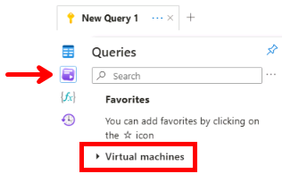

---
lab:
  title: 'Lab 11: Menerapkan Pemantauan'
  module: Administer Monitoring
---

# Lab 11 - Implementasi Pemantauan

## Pengenalan lab

Di lab ini, Anda mempelajari tentang Azure Monitor. Anda belajar membuat peringatan dan mengirimkannya ke grup tindakan. Anda memicu dan menguji peringatan dan memeriksa log aktivitas.  

Lab ini memerlukan langganan Azure. Tipe langganan Anda dapat memengaruhi ketersediaan fitur di lab ini. Anda dapat mengubah wilayah, tetapi langkah-langkah ditulis menggunakan **US Timur**.

## Perkiraan waktu: 40 menit

## Skenario lab

Organisasi Anda telah memigrasikan infrastrukturnya ke Azure. Penting bagi Administrator untuk diberi tahu tentang perubahan infrastruktur yang signifikan. Anda berencana untuk memeriksa kemampuan Azure Monitor, termasuk Analitik Log.

## Simulasi lab interaktif

Ada simulasi lab interaktif yang mungkin berguna topik ini. Simulasi ini memungkinkan Anda mengeklik skenario serupa dengan kecepatan Anda sendiri. Ada perbedaan antara simulasi interaktif dan lab ini, tetapi banyak konsep intinya sama. Langganan Azure tidak diperlukan.

+ [Menerapkan Pemantauan](https://mslabs.cloudguides.com/guides/AZ-104%20Exam%20Guide%20-%20Microsoft%20Azure%20Administrator%20Exercise%2017). Buat ruang kerja Analitik Log dan solusi otomatisasi Azure. Tinjau pengaturan pemantauan dan diagnostik untuk mesin virtual. Tinjau fungsionalitas Azure Monitor dan Analitik Log. 

## Diagram arsitektur


## Keterampilan pekerjaan

+ Tugas 1: Gunakan templat untuk menyediakan infrastruktur.
+ Tugas 2: Buat peringatan.
+ Tugas 3: Konfigurasikan pemberitahuan grup tindakan.
+ Tugas 4: Picu peringatan dan konfirmasikan bahwa peringatan berfungsi.
+ Tugas 5: Konfigurasikan aturan pemrosesan peringatan.
+ Tugas 6: Gunakan kueri log Azure Monitor.

## Tugas 1: Gunakan templat untuk menyediakan infrastruktur

Dalam tugas ini, Anda akan menggunakan komputer virtual yang akan digunakan untuk menguji skenario monitoring.

1. Unduh file lab **\\Allfiles\\Lab11\\az104-11-vm-template.json** ke komputer Anda.

1. Masuk ke **portal Azure** - `https://portal.azure.com`.

1. Dari portal Azure, telusuri dan pilih `Deploy a custom template`.

1. Di halaman penyebaran kustom, pilih **Buat templat Anda sendiri di editor**.

1. Di halaman edit templat, pilih **Muat file**.

1. Temukan dan pilih file **\\Allfiles\\Labs11\\az104-11-vm-template.json**, lalu pilih **Buka**.

1. Pilih **Simpan**.

1. Gunakan informasi berikut untuk melengkapi bidang penyebaran kustom, sehingga semua bidang lainnya tetap memiliki nilai default:

    | Pengaturan       | Nilai         | 
    | ---           | ---           |
    | Langganan  | Langganan Azure Anda |
    | Grup sumber daya| `az104-rg11` (Jika perlu, pilih **Buat baru**)
    | Wilayah        | **US Timur**   |
    | Nama Pengguna      | `localadmin`   |
    | Kata sandi      | Berikan kata sandi yang kompleks |
    
1. Pilih **Tinjau + Buat**, kemudian pilih **Buat**.

1. Tunggu hingga penyebaran selesai, lalu klik **Buka grup sumber daya**.

1. Tinjau sumber daya yang disebarkan. Harus ada satu jaringan virtual dengan satu mesin virtual.

**Konfigurasikan Azure Monitor untuk mesin virtual (ini akan digunakan dalam tugas terakhir)**

1. Di portal, cari dan pilih **Pantau**.

1. Luangkan waktu sebentar untuk meninjau semua alat wawasan, deteksi, triase, dan diagnosis yang tersedia.

1. Pilih **Tampilkan** di kotak **Wawasan VM**, lalu pilih **Konfigurasikan Wawasan**.

1. Pilih **Aktifkan** di samping komputer virtual Anda, lalu **Aktifkan pada bilah Azure Monitor - Insights Onboarding** .

1. Ambil default untuk aturan langganan dan pengumpulan data, lalu pilih **Konfigurasikan**. 

1. Dibutuhkan beberapa menit bagi agen mesin virtual untuk menginstal dan mengonfigurasi, lanjutkan ke langkah berikutnya. 
   
## Tugas 2: Buat peringatan

Dalam tugas ini, Anda membuat peringatan saat mesin virtual dihapus. 

1. Lanjutkan di halaman **Monitor**, pilih **Peringatan**. 

1. Pilih **Buat +** dan pilih **Aturan peringatan**. 

1. Pilih kotak untuk langganan, lalu pilih **Terapkan**. Pemberitahuan ini akan berlaku untuk komputer virtual apa pun dalam langganan. Alternatifnya, Anda dapat menentukan satu mesin tertentu. 

1. Pilih tab **Kondisi**, lalu pilih tautan **Lihat semua sinyal**.

1. Cari dan pilih **Hapus Mesin Virtual (Virtual Machines)**. Perhatikan sinyal bawaan lainnya. Pilih **Terapkan**

1. Di area **Logika peringatan** (gulir ke bawah), tinjau pilihan **Tingkat peristiwa**. Biarkan default **Semua dipilih**.

1. Tinjau pilihan **Status**. Biarkan default **Semua dipilih**.

1. Biarkan panel **Buat aturan peringatan** terbuka untuk tugas berikutnya.

## Tugas 3: Konfigurasikan pemberitahuan grup tindakan

Dalam tugas ini, jika peringatan dipicu, kirim pemberitahuan email ke tim operasi. 

1. Lanjutkan mengerjakan peringatan Anda. Pilih **Gunakan grup** tindakan lalu pilih **Buat grup** tindakan di bilah **Pilih grup** tindakan.

    >**Tahukah Anda?** Anda dapat menambahkan hingga lima grup tindakan ke aturan peringatan. Grup tindakan dijalankan secara bersamaan, tanpa urutan tertentu. Beberapa aturan peringatan dapat menggunakan grup tindakan yang sama. 

1. Pada tab **Dasar**, masukkan nilai berikut untuk setiap pengaturan.

    | Pengaturan | Nilai |
    |---------|---------|
    | **Detail proyek** |
    | Langganan | langganan Anda |
    | Grup sumber daya | **az104-rg11** |
    | Wilayah | **Global** (default) |
    | **Detail instans** |
    | Nama grup tindakan | `Alert the operations team` (harus unik dalam grup sumber daya) |
    | Nama tampilan | `AlertOpsTeam` |

1. Pilih **Berikutnya: Pemberitahuan**, lalu masukkan nilai berikut untuk setiap pengaturan.

    | Pengaturan | Nilai |
    |---------|---------|
    | Jenis pemberitahuan | Pilih **Email/ Pesan SMS/Push/Voice** |
    | Nama | `VM was deleted` |

1. Pilih **Email**, dan di kotak **Email**, masukkan alamat email Anda, lalu pilih **OK**. 

    >**Catatan:** Anda akan menerima pemberitahuan email yang mengatakan bahwa Anda ditambahkan ke grup tindakan. Mungkin ada penundaan beberapa menit, tetapi itu adalah tanda pasti aturan telah disebarkan.

1. Pilih **Tinjau ulang + Buat**, lalu pilih **Buat**.
   
1. Setelah grup tindakan dibuat, lanjutkan ke **Berikutnya: Tab Detail**, lalu masukkan nilai berikut untuk setiap pengaturan.

    | Pengaturan | Nilai |
    |---------|---------|
    | Nama aturan pemberitahuan | `VM was deleted` |
    | Deskripsi aturan peringatan | `A VM in your resource group was deleted` |

1. Pilih **Tinjau + buat** untuk memvalidasi input Anda, lalu pilih **Buat**.

## Tugas 4: Picu peringatan dan konfirmasikan bahwa peringatan berfungsi

Dalam tugas ini, Anda memicu peringatan dan mengonfirmasi bahwa pemberitahuan telah dikirim. 

>**Catatan:** Jika Anda menghapus mesin virtual sebelum aturan peringatan disebarkan, aturan peringatan mungkin tidak akan terpicu. 

1. Di portal, cari dan pilih **Mesin virtual**.

1. Centang kotak untuk mesin virtual **az104-vm0**.

1. Pilih **Hapus** dari bilah menu.

1. Centang kotak **Terapkan penghapusan paksa**. Centang kotak di bagian bawah yang mengonfirmasi bahwa Anda ingin sumber daya dihapus dan pilih **Hapus**. 

1. Di bilah judul, pilih ikon **Pemberitahuan** dan tunggu hingga **vm0** berhasil dihapus.

1. Anda akan menerima email pemberitahuan yang berbunyi, **Pemberitahuan penting: VM peringatan Azure Monitor telah dihapus telah diaktifkan...** Jika tidak, buka program email Anda dan cari email dari azure-noreply@microsoft.com.

    
   
1. Pada menu sumber daya portal Microsoft Azure, pilih **Pantau**, lalu pilih **Peringatan** di menu sebelah kiri.

1. Anda akan memiliki tiga peringatan verbose yang dihasilkan dengan menghapus **vm0**.

   >**Catatan:** Diperlukan waktu beberapa menit agar email peringatan terkirim dan peringatan diperbarui di portal. Jika Anda tidak ingin menunggu, lanjutkan ke tugas berikutnya, lalu kembali. 

1. Pilih nama salah satu peringatan (Misalnya, **VM telah dihapus**). Panel **Rincian peringatan** muncul yang menampilkan detail selengkapnya tentang acara tersebut.

## Tugas 5: Konfigurasikan aturan pemrosesan peringatan

Dalam tugas ini, Anda membuat aturan peringatan untuk menyembunyikan pemberitahuan selama periode pemeliharaan. 

1. Lanjutkan di bilah **Peringatan**, pilih **Aturan pemrosesan peringatan**, lalu **+ Buat**. 
   
1. Pilih Langganan** Anda**, lalu pilih **Terapkan**.
   
1. Pilih **Berikutnya: Pengaturan aturan**, lalu pilih **Sembunyikan pemberitahuan**.
   
1. Pilih **Berikutnya: Menjadwalkan**.
   
1. Secara default, aturan berfungsi sepanjang waktu, kecuali jika Anda menonaktifkannya atau mengonfigurasi jadwal. Anda akan menentukan aturan untuk menyembunyikan pemberitahuan selama pemeliharaan semalam.
Masukkan pengaturan berikut untuk penjadwalan aturan pemrosesan peringatan:

    | Pengaturan | Nilai |
    |---------|---------|
    | Terapkan aturan | Pada waktu tertentu |
    | Mulai | Masukkan tanggal hari ini pukul 22.00. |
    | Akhir | Masukkan tanggal besok pukul 07.00. |
    | Zona waktu | Pilih zona waktu lokal. |

    

1. Pilih **Berikutnya: Detail** dan masukkan pengaturan ini:

    | Pengaturan | Nilai |
    |---------|---------|
    | Grup sumber daya | **az104-rg11** |
    | Nama aturan | `Planned Maintenance` |
    | Deskripsi | `Suppress notifications during planned maintenance.` |

1. Pilih **Tinjau + buat** untuk memvalidasi input Anda, lalu pilih **Buat**.

## Tugas 6: Gunakan kueri log Azure Monitor

Dalam tugas ini, Anda akan menggunakan Azure Monitor untuk mengkueri data yang diambil dari mesin virtual.

1. Di portal Azure, cari dan pilih `Monitor`, lalu klik **Log**.

1. Jika perlu, tutup layar splash. 

1. Jika perlu, pilih cakupan, Langganan** Anda**. Pilih **Terapkan**. 

1. Di tab **Kueri**, pilih **Mesin virtual** (panel kiri). Anda mungkin perlu membuka kembali bilah.

    

1. Tinjau kueri yang tersedia. **Jalankan** (arahkan mouse ke atas kueri) kueri **Hitung heartbeat**.

1. Anda harus menerima jumlah heartbeat ketika mesin virtual berjalan.

1. Di sisi kanan layar pilih menu drop-down di samping **Mode** sederhana, pilih **mode** KQL. Tinjau kueri. Kueri ini menggunakan tabel *heartbeat*.

1. Ganti kueri dengan yang ini, lalu klik **Jalankan**. Tinjau bagan yang dihasilkan. 

   ```
    InsightsMetrics
    | where TimeGenerated > ago(1h)
    | where Name == "UtilizationPercentage"
    | summarize avg(Val) by bin(TimeGenerated, 5m), Computer //split up by computer
    | render timechart
   ```

    >**Catatan:** Jika kueri tidak menempel dengan benar, coba tempelkan ke Notepad lalu salin dan tempel ulang ke bidang kueri.

1. Saat Anda memiliki waktu, tinjau dan jalankan kueri lain. 

    >**Tahukah Anda?**: Jika Anda ingin berlatih dengan kueri lain, ada [Lingkungan Demo Analitik Log](https://learn.microsoft.com/azure/azure-monitor/logs/log-analytics-tutorial#open-log-analytics).
    
    >**Tahukah Anda?**: Setelah menemukan kueri yang disuka, Anda bisa membuat peringatan dari kueri tersebut. 

## Bersihkan sumber daya Anda

Jika Anda bekerja dengan **langganan Anda sendiri** luangkan waktu sebentar untuk menghapus sumber daya lab. Hal ini akan memastikan sumber daya dikosongkan dan biaya diminimalkan. Cara termudah untuk menghapus sumber daya lab adalah dengan menghapus grup sumber daya lab. 

+ Di portal Microsoft Azure, pilih grup sumber daya, pilih **Hapus grup sumber daya**, **Masukkan nama grup sumber daya**, lalu klik **Hapus**.
+ Menggunakan Azure PowerShell, `Remove-AzResourceGroup -Name resourceGroupName`.
+ Menggunakan CLI, `az group delete --name resourceGroupName`.

## Perluas pemelajaran Anda dengan Copilot
Copilot dapat membantu Anda mempelajari cara menggunakan alat pembuatan skrip Azure. Copilot juga dapat membantu di area yang tidak tercakup dalam lab atau ketika Anda memerlukan informasi lebih lanjut. Buka browser Edge dan pilih Copilot (kanan atas) atau navigasi *copilot.microsoft.com*. Luangkan beberapa menit untuk mencoba perintah ini.

+ Apa langkah-langkah konfigurasi dasar yang akan diperingatkan di Azure saat mesin virtual tidak berfungsi?
+ Bagaimana cara diberi tahu saat peringatan Azure dipicu?
+ Buat kueri Azure Monitor untuk memberikan informasi performa CPU mesin virtual.

## Pelajari lebih lanjut dengan pelatihan mandiri

+ [Tingkatkan respons insiden dengan memberi tahu di Azure](https://learn.microsoft.com/en-us/training/modules/incident-response-with-alerting-on-azure/). Tanggapi insiden dan aktivitas di infrastruktur Anda melalui kapabilitas peringatan di Azure Monitor.
+ [Pantau mesin virtual Azure dengan Azure Monitor](https://learn.microsoft.com/en-us/training/modules/monitor-azure-vm-using-diagnostic-data/). Pantau mesin virtual Azure Anda dengan menggunakan Azure Monitor untuk mengumpulkan dan menganalisis metrik serta log klien dan host mesin virtual.

## Poin penting

Selamat atas penyelesaian lab ini. Berikut adalah kesimpulan utama dari lab ini. 

+ Peringatan membantu Anda mendeteksi dan mengatasi masalah sebelum pengguna menyadari bahwa mungkin ada masalah dengan infrastruktur atau aplikasi Anda.
+ Anda dapat memperingatkan metrik atau sumber data log apa pun di platform data Azure Monitor.
+ Aturan peringatan memantau data Anda dan menangkap sinyal yang menunjukkan sesuatu yang terjadi pada sumber daya yang ditentukan.
+ Peringatan dipicu jika kondisi aturan peringatan terpenuhi. Beberapa tindakan (email, SMS, push, suara) dapat dipicu.
+ Grup tindakan mencakup individu yang harus diberi tahu tentang peringatan.
